# Отчёт по практической работе №3

**Подготовил:** Студент группы БСБО-09-23
**ФИО:** Данилов Михаил Алексеевич

---

## 1. Программные задачи и цели

Основная цель данной практической работы — глубокое изучение механизмов взаимодействия компонентов Android-приложений (Intents), освоение архитектуры фрагментов (Fragments), а также реализация сложной пользовательской навигации с использованием Navigation Component. В ходе работы требовалось изучить:

- Механизм намерений (Intents) для передачи данных между активностями (метод `putExtra` и `getIntent`).
- Отправку и получение пользовательских данных через системное окно `createChooser` (действие `ACTION_SEND`).
- Современный подход к получению результата работы другой активности с использованием `Activity Result API` (`registerForActivityResult`).
- Использование неявных намерений (Implicit Intents) для интеграции с системными приложениями (звонилка, браузер, карты) посредством парсинга URI.
- Работу с фрагментами: динамическое добавление, замена через `FragmentManager` и `FragmentTransaction`.
- Адаптацию пользовательского интерфейса под различные ориентации экрана (портретная и ландшафтная).
- Создание полноценного бокового навигационного меню (Navigation Drawer) на пустом шаблоне с применением компонентов Material Design 3 и библиотеки навигации (NavGraph, NavController).

## 2. Организация проекта

Разработка велась в рамках единого проекта `Lesson3`, который был разделен на 6 независимых функциональных модулей:

1. `IntentApp` — передача данных (системного времени) из одной активности в другую с помощью явных намерений.
2. `Sharer` — обмен данными между приложениями и вызов системного окна выбора (`createChooser`).
3. `FavoriteBook` — вызов второй активности для ввода данных и возврат результата в первую активность через Activity Result API.
4. `SystemIntentsApp` — использование неявных намерений для вызова системного номеронабирателя, браузера и Google Карт.
5. `SimpleFragmentApp` — динамическое управление фрагментами и создание адаптивной верстки (разные макеты для вертикальной и горизонтальной ориентации).
6. `MireaProject` (Контрольное задание) — конструирование паттерна Navigation Drawer, работа с WebView и сложной Material-разметкой.

---

## 3. Описание этапов разработки

### 3.1. Передача данных между активностями (модуль `IntentApp`)

В данном модуле была реализована передача строковых данных между экранами. В главной активности по нажатию кнопки вычисляется текущее системное время, форматируется и передается во вторую активность с использованием метода `putExtra`. Во второй активности данные извлекаются и выводятся на экран вместе с вычисленным квадратом номера по списку.

**Листинг** `activity_main.xml`:
```xml
<?xml version="1.0" encoding="utf-8"?>
<LinearLayout xmlns:android="http://schemas.android.com/apk/res/android"
    android:layout_width="match_parent"
    android:layout_height="match_parent"
    android:gravity="center"
    android:orientation="vertical"
    android:padding="24dp">

    <TextView
        android:layout_width="wrap_content"
        android:layout_height="wrap_content"
        android:layout_marginBottom="24dp"
        android:text="Нажми"
        android:textAlignment="center"
        android:textSize="18sp" />

    <Button
        android:layout_width="wrap_content"
        android:layout_height="wrap_content"
        android:onClick="openSecondActivity"
        android:text="Перейти во вторую Activity" />

</LinearLayout>
```

**Листинг** `MainActivity.java`:
```java
package ru.mirea.danilov.intentapp;

import android.content.Intent;
import android.os.Bundle;
import android.view.View;

import androidx.appcompat.app.AppCompatActivity;

import java.text.SimpleDateFormat;
import java.util.Date;
import java.util.Locale;

public class MainActivity extends AppCompatActivity {

    private static final int GROUP_LIST_NUMBER = 5;

    @Override
    protected void onCreate(Bundle savedInstanceState) {
        super.onCreate(savedInstanceState);
        setContentView(R.layout.activity_main);
    }

    public void openSecondActivity(View view) {
        long dateInMillis = System.currentTimeMillis();
        String format = "yyyy-MM-dd HH:mm:ss";
        final SimpleDateFormat sdf = new SimpleDateFormat(format, Locale.getDefault());
        String dateString = sdf.format(new Date(dateInMillis));

        int square = GROUP_LIST_NUMBER * GROUP_LIST_NUMBER;

        Intent intent = new Intent(this, SecondActivity.class);
        intent.putExtra("current_time", dateString);
        intent.putExtra("number_square", square);
        startActivity(intent);
    }
}
```

**Листинг** `activity_second.xml`:
```xml
<?xml version="1.0" encoding="utf-8"?>
<ScrollView xmlns:android="http://schemas.android.com/apk/res/android"
    android:layout_width="match_parent"
    android:layout_height="match_parent">

    <TextView
        android:id="@+id/textViewResult"
        android:layout_width="match_parent"
        android:layout_height="wrap_content"
        android:padding="24dp"
        android:textSize="22sp" />

</ScrollView>
```

**Листинг** `SecondActivity.java`:
```java
package ru.mirea.danilov.intentapp;

import android.content.Intent;
import android.os.Bundle;
import android.widget.TextView;

import androidx.appcompat.app.AppCompatActivity;

public class SecondActivity extends AppCompatActivity {

    private TextView textViewResult;

    @Override
    protected void onCreate(Bundle savedInstanceState) {
        super.onCreate(savedInstanceState);
        setContentView(R.layout.activity_second);

        textViewResult = findViewById(R.id.textViewResult);

        Intent intent = getIntent();
        String time = intent.getStringExtra("current_time");
        int square = intent.getIntExtra("number_square", 0);

        String result = "Квадрат значения моего номера по списку составляет число "
                + square + ", а текущее время " + time;

        textViewResult.setText(result);
    }
}
```

**Демонстрация работы:**
> *Рисунок 1: Главный экран модуля IntentApp (кнопка передачи времени)*

> *Рисунок 2: Экран SecondActivity с отображением переданного времени и текста*
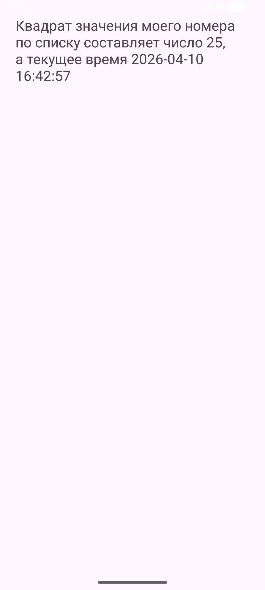
### 3.2. Обмен данными и диалог выбора (модуль `Sharer`)

В этом модуле изучена отправка сообщений (текст, изображения) в другие приложения с использованием действия `ACTION_SEND`. Вызов метода `Intent.createChooser` позволяет отобразить пользователю стандартное системное окно выбора приложения (мессенджеры, почта и т.д.) для обработки переданных данных. Также в манифесте был задекларирован `intent-filter` для возможности приложения выступать в роли получателя.

**Листинг** `activity_main.xml`:
```xml
<?xml version="1.0" encoding="utf-8"?>
<LinearLayout xmlns:android="http://schemas.android.com/apk/res/android"
    android:layout_width="match_parent"
    android:layout_height="match_parent"
    android:gravity="center_horizontal"
    android:orientation="vertical"
    android:padding="24dp">

    <Button
        android:layout_width="wrap_content"
        android:layout_height="wrap_content"
        android:onClick="onShareText"
        android:text="Отправить текст" />

    <Button
        android:layout_width="wrap_content"
        android:layout_height="wrap_content"
        android:layout_marginTop="16dp"
        android:onClick="onPickData"
        android:text="Выбрать данные" />

    <TextView
        android:id="@+id/textViewPickedData"
        android:layout_width="match_parent"
        android:layout_height="wrap_content"
        android:layout_marginTop="24dp"
        android:text="Здесь появится URI выбранных данных"
        android:textSize="18sp" />

</LinearLayout>
```

**Листинг** `AndroidManifest.xml` (Фрагмент с `intent-filter`):
```xml
<activity
        android:name=".MainActivity"
        android:exported="true">
        <intent-filter>
            <action android:name="android.intent.action.MAIN" />

            <category android:name="android.intent.category.LAUNCHER" />
            <action android:name="android.intent.action.SEND" />
            <category android:name="android.intent.category.DEFAULT" />
            <data android:mimeType="text/plain" />
            <data android:mimeType="image/*" />
        </intent-filter>
    </activity>
```

**Листинг** `MainActivity.java`:
```java
package ru.mirea.danilov.sharer;

import android.app.Activity;
import android.content.Intent;
import android.os.Bundle;
import android.view.View;
import android.widget.TextView;

import androidx.activity.result.ActivityResult;
import androidx.activity.result.ActivityResultCallback;
import androidx.activity.result.ActivityResultLauncher;
import androidx.activity.result.contract.ActivityResultContracts;
import androidx.appcompat.app.AppCompatActivity;

public class MainActivity extends AppCompatActivity {

    private ActivityResultLauncher<Intent> activityResultLauncher;
    private TextView textViewPickedData;

    @Override
    protected void onCreate(Bundle savedInstanceState) {
        super.onCreate(savedInstanceState);
        setContentView(R.layout.activity_main);

        textViewPickedData = findViewById(R.id.textViewPickedData);

        ActivityResultCallback<ActivityResult> callback = new ActivityResultCallback<ActivityResult>() {
            @Override
            public void onActivityResult(ActivityResult result) {
                if (result.getResultCode() == Activity.RESULT_OK && result.getData() != null) {
                    String dataString = result.getData().getDataString();
                    if (dataString == null) {
                        dataString = "URI не получен";
                    }
                    textViewPickedData.setText("Полученные данные: " + dataString);
                } else {
                    textViewPickedData.setText("Пользователь ничего не выбрал");
                }
            }
        };

        activityResultLauncher = registerForActivityResult(
                new ActivityResultContracts.StartActivityForResult(),
                callback
        );
    }

    public void onShareText(View view) {
        Intent intent = new Intent(Intent.ACTION_SEND);
        intent.setType("text/plain");
        intent.putExtra(Intent.EXTRA_TEXT, "Mirea");
        startActivity(Intent.createChooser(intent, "Выбор за вами!"));
    }

    public void onPickData(View view) {
        Intent intent = new Intent(Intent.ACTION_PICK);
        intent.setType("*/*");
        activityResultLauncher.launch(intent);
    }
}
```

**Листинг** `ShareActivity.java`:
```java
package ru.mirea.danilov.sharer;

import android.content.Intent;
import android.os.Bundle;
import android.widget.TextView;

import androidx.appcompat.app.AppCompatActivity;

public class ShareActivity extends AppCompatActivity {

    private TextView textViewSharedData;

    @Override
    protected void onCreate(Bundle savedInstanceState) {
        super.onCreate(savedInstanceState);
        setContentView(R.layout.activity_share);

        textViewSharedData = findViewById(R.id.textViewSharedData);

        Intent intent = getIntent();
        String resultText = "Данные не получены";

        if (Intent.ACTION_SEND.equals(intent.getAction()) && intent.getType() != null) {
            String type = intent.getType();

            if ("text/plain".equals(type)) {
                String sharedText = intent.getStringExtra(Intent.EXTRA_TEXT);
                if (sharedText != null && !sharedText.isEmpty()) {
                    resultText = sharedText;
                }
            } else if (type.startsWith("image/")) {
                resultText = "Приложение готово принимать изображения";
            }
        }

        textViewSharedData.setText(resultText);
    }
}
```

**Демонстрация работы:**
> *Рисунок 3: Главный экран модуля Sharer*
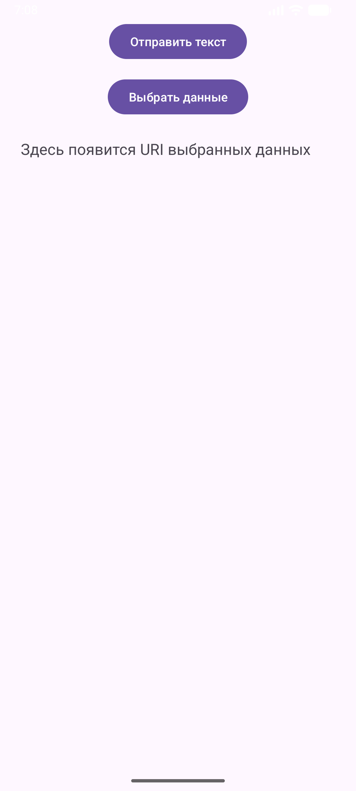
> *Рисунок 4: Системное диалоговое окно (Chooser) со списком доступных приложений*
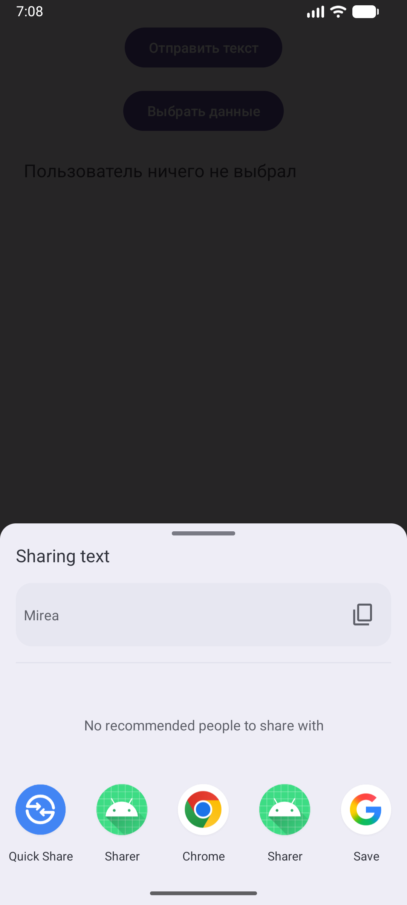

### 3.3. Возврат результата из активности (модуль `FavoriteBook`)

Цель модуля — отказ от устаревшего метода `startActivityForResult` в пользу современного `Activity Result API`. Главная активность запускает `ShareActivity`, ожидает от нее ввод текста (названия любимой книги) и динамически обновляет свой интерфейс при успешном возврате данных (`Activity.RESULT_OK`).

**Листинг** `activity_main.xml`:
```xml
<?xml version="1.0" encoding="utf-8"?>
<LinearLayout xmlns:android="http://schemas.android.com/apk/res/android"
    android:layout_width="match_parent"
    android:layout_height="match_parent"
    android:gravity="center"
    android:orientation="vertical"
    android:padding="24dp">

    <TextView
        android:id="@+id/textViewBook"
        android:layout_width="wrap_content"
        android:layout_height="wrap_content"
        android:layout_marginBottom="24dp"
        android:text="Здесь будет название вашей любимой книги"
        android:textAlignment="center"
        android:textSize="20sp" />

    <Button
        android:layout_width="wrap_content"
        android:layout_height="wrap_content"
        android:onClick="getInfoAboutBook"
        android:text="Ввести данные" />

</LinearLayout>
```

**Листинг** `MainActivity.java`:
```java
package ru.mirea.danilov.favoritebook;

import android.app.Activity;
import android.content.Intent;
import android.os.Bundle;
import android.view.View;
import android.widget.TextView;

import androidx.activity.result.ActivityResult;
import androidx.activity.result.ActivityResultCallback;
import androidx.activity.result.ActivityResultLauncher;
import androidx.activity.result.contract.ActivityResultContracts;
import androidx.appcompat.app.AppCompatActivity;

public class MainActivity extends AppCompatActivity {

    public static final String KEY = "book_name";
    public static final String USER_MESSAGE = "MESSAGE";

    private ActivityResultLauncher<Intent> activityResultLauncher;
    private TextView textViewUserBook;

    @Override
    protected void onCreate(Bundle savedInstanceState) {
        super.onCreate(savedInstanceState);
        setContentView(R.layout.activity_main);

        textViewUserBook = findViewById(R.id.textViewBook);

        ActivityResultCallback<ActivityResult> callback = new ActivityResultCallback<ActivityResult>() {
            @Override
            public void onActivityResult(ActivityResult result) {
                if (result.getResultCode() == Activity.RESULT_OK && result.getData() != null) {
                    String userBook = result.getData().getStringExtra(USER_MESSAGE);
                    textViewUserBook.setText("Название Вашей любимой книги: " + userBook);
                }
            }
        };

        activityResultLauncher = registerForActivityResult(
                new ActivityResultContracts.StartActivityForResult(),
                callback
        );
    }

    public void getInfoAboutBook(View view) {
        Intent intent = new Intent(this, ShareActivity.class);
        intent.putExtra(KEY, "Мастер и маргарита");
        activityResultLauncher.launch(intent);
    }
}
```

**Листинг** `activity_share.xml`:
```xml
<?xml version="1.0" encoding="utf-8"?>
<LinearLayout xmlns:android="http://schemas.android.com/apk/res/android"
    android:layout_width="match_parent"
    android:layout_height="match_parent"
    android:gravity="center"
    android:orientation="vertical"
    android:padding="24dp">

    <TextView
        android:id="@+id/textViewDeveloperBook"
        android:layout_width="wrap_content"
        android:layout_height="wrap_content"
        android:layout_marginBottom="24dp"
        android:textSize="20sp" />

    <EditText
        android:id="@+id/editTextUserBook"
        android:layout_width="match_parent"
        android:layout_height="wrap_content"
        android:hint="Введите название вашей любимой книги" />

    <Button
        android:layout_width="wrap_content"
        android:layout_height="wrap_content"
        android:layout_marginTop="24dp"
        android:onClick="sendBookName"
        android:text="Отправить" />

</LinearLayout>
```

**Листинг** `ShareActivity.java`:
```java
package ru.mirea.danilov.favoritebook;

import android.app.Activity;
import android.content.Intent;
import android.os.Bundle;
import android.view.View;
import android.widget.EditText;
import android.widget.TextView;

import androidx.appcompat.app.AppCompatActivity;

public class ShareActivity extends AppCompatActivity {

    private TextView textViewDeveloperBook;
    private EditText editTextUserBook;

    @Override
    protected void onCreate(Bundle savedInstanceState) {
        super.onCreate(savedInstanceState);
        setContentView(R.layout.activity_share);

        textViewDeveloperBook = findViewById(R.id.textViewDeveloperBook);
        editTextUserBook = findViewById(R.id.editTextUserBook);

        Bundle extras = getIntent().getExtras();
        if (extras != null) {
            String developerBook = extras.getString(MainActivity.KEY);
            textViewDeveloperBook.setText("Любимая книга разработчика — " + developerBook);
        }
    }

    public void sendBookName(View view) {
        String text = editTextUserBook.getText().toString().trim();

        if (text.isEmpty()) {
            editTextUserBook.setError("Введите название книги");
            return;
        }

        Intent data = new Intent();
        data.putExtra(MainActivity.USER_MESSAGE, text);
        setResult(Activity.RESULT_OK, data);
        finish();
    }
}
```

**Демонстрация работы:**
> *Рисунок 5: Главный экран модуля FavoriteBook до ввода данных*
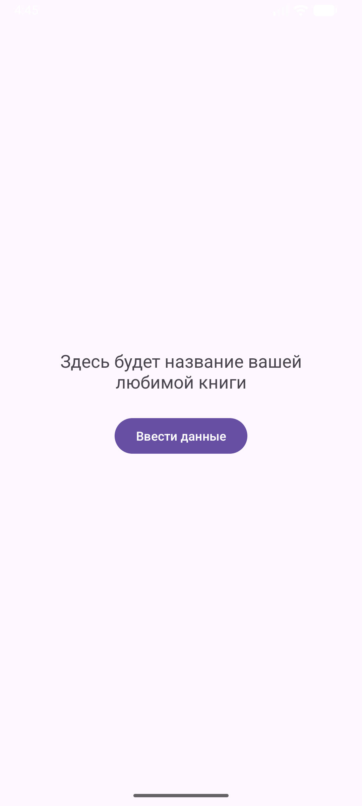
> *Рисунок 6: Экран ShareActivity (ввод названия книги)*
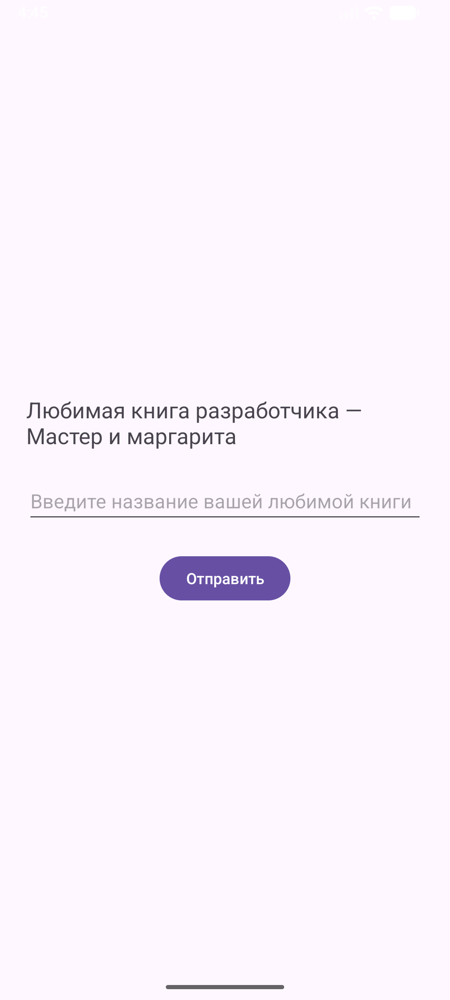
> *Рисунок 7: Главный экран после возврата результата (название книги обновлено)*
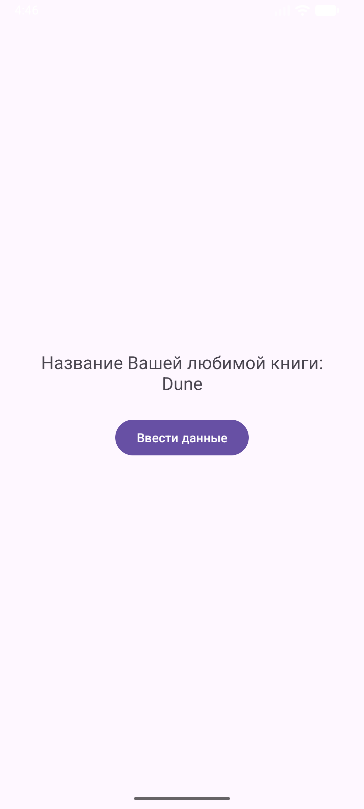

### 3.4. Неявные вызовы системных приложений (модуль `SystemIntentsApp`)

В зависимости от типа действия (`ACTION_DIAL`, `ACTION_VIEW`) и переданного URI-адреса (`tel:`, `http:`, `geo:`), операционная система Android сама определяет, какое встроенное приложение нужно запустить для обработки запроса.

**Листинг** `activity_main.xml`:
```xml
<?xml version="1.0" encoding="utf-8"?>
<androidx.constraintlayout.widget.ConstraintLayout xmlns:android="http://schemas.android.com/apk/res/android"
    xmlns:app="http://schemas.android.com/apk/res-auto"
    xmlns:tools="http://schemas.android.com/tools"
    android:layout_width="match_parent"
    android:layout_height="match_parent">

    <Button
        android:id="@+id/button"
        android:layout_width="404dp"
        android:layout_height="48dp"
        android:onClick="onClickCall"
        android:text="ПОЗВОНИТЬ"
        app:layout_constraintBottom_toBottomOf="parent"
        app:layout_constraintTop_toTopOf="parent"
        app:layout_constraintVertical_bias="0.345"
        tools:layout_editor_absoluteX="3dp" />

    <Button
        android:id="@+id/button2"
        android:layout_width="404dp"
        android:layout_height="48dp"
        android:onClick="onClickOpenBrowser"
        android:text="ОТКРЫТЬ БРАУЗЕР"
        app:layout_constraintBottom_toBottomOf="parent"
        app:layout_constraintTop_toTopOf="parent"
        app:layout_constraintVertical_bias="0.415"
        tools:layout_editor_absoluteX="3dp" />

    <Button
        android:id="@+id/button3"
        android:layout_width="404dp"
        android:layout_height="48dp"
        android:onClick="onClickOpenMaps"
        android:text="ОТКРЫТЬ КАРТУ"
        app:layout_constraintBottom_toBottomOf="parent"
        app:layout_constraintTop_toTopOf="parent"
        app:layout_constraintVertical_bias="0.486"
        tools:layout_editor_absoluteX="3dp" />
</androidx.constraintlayout.widget.ConstraintLayout>
```

**Листинг** `MainActivity.java`:
```java
package ru.mirea.danilov.systemintentsapp;

import android.content.Intent;
import android.net.Uri;
import android.os.Bundle;
import android.view.View;
import androidx.appcompat.app.AppCompatActivity;

public class MainActivity extends AppCompatActivity {
    @Override
    protected void onCreate(Bundle savedInstanceState) {
        super.onCreate(savedInstanceState);
        setContentView(R.layout.activity_main);
    }

    public void onClickCall(View view) {
        Intent intent = new Intent(Intent.ACTION_DIAL);
        intent.setData(Uri.parse("tel:89811112233"));
        startActivity(intent);
    }

    public void onClickOpenBrowser(View view) {
        Intent intent = new Intent(Intent.ACTION_VIEW);
        intent.setData(Uri.parse("http://www.motorpage.ru/mclaren/765lt/last/"));
        startActivity(intent);
    }

    public void onClickOpenMaps(View view) {
        Intent intent = new Intent(Intent.ACTION_VIEW);
        intent.setData(Uri.parse("geo:55.749479,37.613944"));
        startActivity(intent);
    }
}
```

**Демонстрация работы:**
> *Рисунок 8: Главный экран с выбором действий*
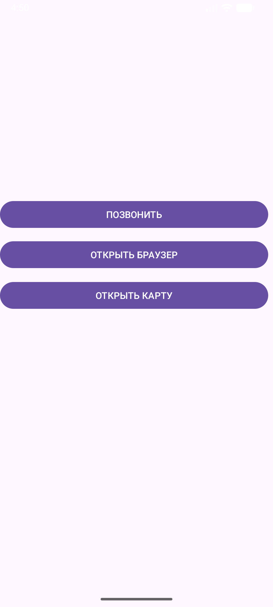
> *Рисунок 9: Системный номеронабиратель после нажатия "Позвонить"*
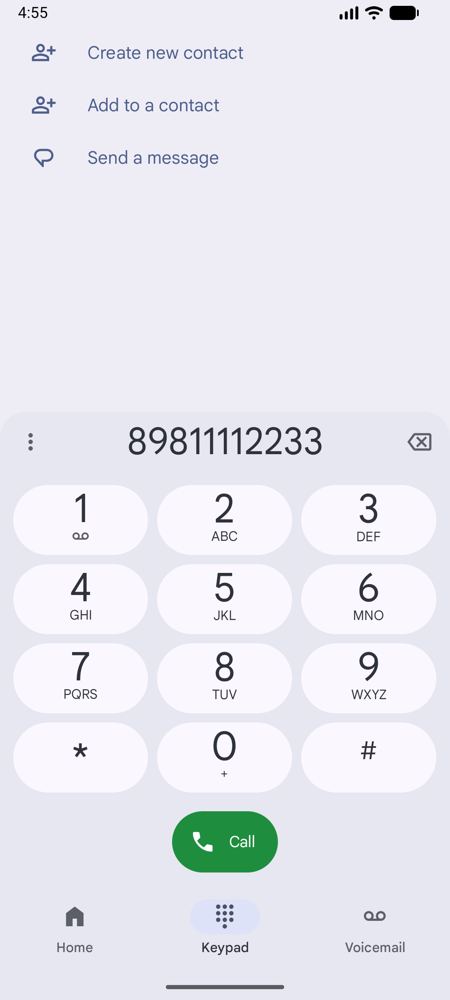
> *Рисунок 10: Запуск браузера*

> *Рисунок 11: Запуск приложения Google Maps по координатам*
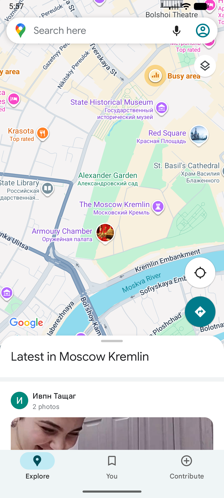

### 3.5. Работа с фрагментами и ориентацией экрана (модуль `SimpleFragmentApp`)

Модуль демонстрирует основы работы с фрагментами. Для вертикальной ориентации реализована подмена фрагментов в контейнере `FrameLayout` по нажатию кнопок через `FragmentManager`. Для горизонтальной ориентации был создан специальный макет (в папке `layout-land`), где оба фрагмента отображаются одновременно с помощью `FragmentContainerView`.

**Листинг** `fragment_first.xml`:
```xml
<FrameLayout xmlns:android="http://schemas.android.com/apk/res/android"
    xmlns:tools="http://schemas.android.com/tools"
    android:layout_width="match_parent"
    android:layout_height="match_parent"
    android:background="#AB9735"
    tools:context="ru.mirea.danilov.simplefragmentapp.FirstFragment" />
```

**Листинг** `fragment_second.xml`:
```xml
<FrameLayout xmlns:android="http://schemas.android.com/apk/res/android"
    xmlns:tools="http://schemas.android.com/tools"
    android:layout_width="match_parent"
    android:layout_height="match_parent"
    android:background="#7890E9"
    tools:context="ru.mirea.danilov.simplefragmentapp.SecondFragment" />
```
*(Листинги классов FirstFragment.java и SecondFragment.java опущены, так как они содержат стандартный сгенерированный код среды Android Studio).*

**Листинг** `activity_main.xml` (Портретная ориентация):
```xml
<?xml version="1.0" encoding="utf-8"?>
<LinearLayout xmlns:android="http://schemas.android.com/apk/res/android"
    android:layout_width="match_parent"
    android:layout_height="match_parent"
    android:orientation="vertical">

    <LinearLayout
        android:layout_width="match_parent"
        android:layout_height="wrap_content"
        android:orientation="horizontal">
        <Button
            android:id="@+id/btnFirstFragment"
            android:onClick="onClick"
            android:layout_width="0dp"
            android:layout_height="wrap_content"
            android:layout_weight="1"
            android:text="Первый Fragment" />
        <Button
            android:id="@+id/btnSecondFragment"
            android:onClick="onClick"
            android:layout_width="0dp"
            android:layout_height="wrap_content"
            android:layout_weight="1"
            android:text="Второй Fragment" />
    </LinearLayout>

    <FrameLayout
        android:id="@+id/fragmentContainer"
        android:layout_width="match_parent"
        android:layout_height="match_parent" />
</LinearLayout>
```

**Листинг** `activity_main.xml` (Ландшафтная ориентация - папка `layout-land`):
```xml
<?xml version="1.0" encoding="utf-8"?>
<LinearLayout xmlns:android="http://schemas.android.com/apk/res/android"
    android:layout_width="match_parent"
    android:layout_height="match_parent"
    android:orientation="horizontal">

    <fragment
        android:id="@+id/fragmentLeft"
        android:name="ru.mirea.danilov.simplefragmentapp.FirstFragment"
        android:layout_width="0dp"
        android:layout_height="match_parent"
        android:layout_weight="1" />

    <fragment
        android:id="@+id/fragmentRight"
        android:name="ru.mirea.danilov.simplefragmentapp.SecondFragment"
        android:layout_width="0dp"
        android:layout_height="match_parent"
        android:layout_weight="1" />

</LinearLayout>
```

**Листинг** `MainActivity.java`:
```java
package ru.mirea.danilov.simplefragmentapp;

import android.os.Bundle;
import android.view.View;

import androidx.appcompat.app.AppCompatActivity;
import androidx.fragment.app.Fragment;

public class MainActivity extends AppCompatActivity {

    private Fragment firstFragment;
    private Fragment secondFragment;

    @Override
    protected void onCreate(Bundle savedInstanceState) {
        super.onCreate(savedInstanceState);
        setContentView(R.layout.activity_main);

        firstFragment = new FirstFragment();
        secondFragment = new SecondFragment();

        if (savedInstanceState == null && findViewById(R.id.fragmentContainer) != null) {
            getSupportFragmentManager()
                    .beginTransaction()
                    .replace(R.id.fragmentContainer, firstFragment)
                    .commit();
        }
    }

    public void onClick(View view) {
        if (findViewById(R.id.fragmentContainer) == null) {
            return;
        }

        int id = view.getId();

        if (id == R.id.btnFirstFragment) {
            getSupportFragmentManager()
                    .beginTransaction()
                    .replace(R.id.fragmentContainer, firstFragment)
                    .commit();
        } else if (id == R.id.btnSecondFragment) {
            getSupportFragmentManager()
                    .beginTransaction()
                    .replace(R.id.fragmentContainer, secondFragment)
                    .commit();
        }
    }
}
```

**Демонстрация работы:**
> *Рисунок 12: Приложение в портретной ориентации (загружен первый фрагмент)*
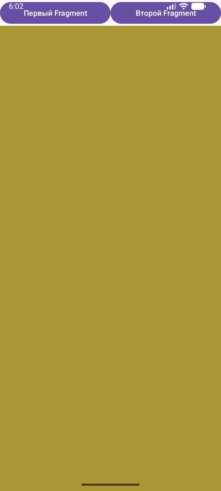
> *Рисунок 13: Приложение в портретной ориентации (загружен второй фрагмент)*
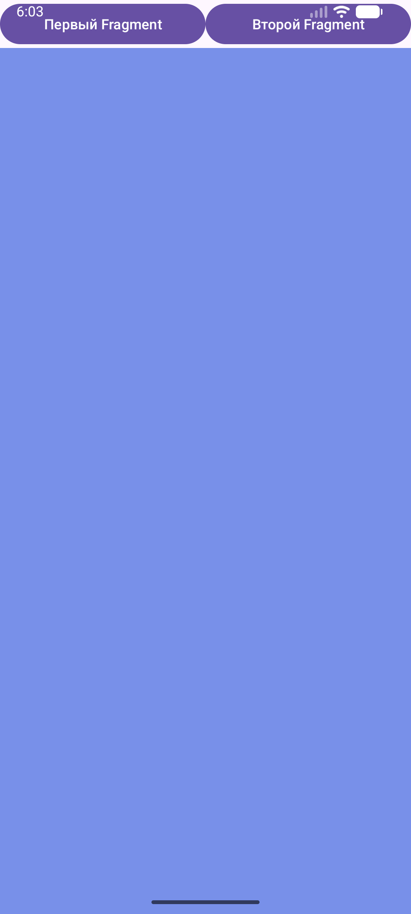
> *Рисунок 14: Приложение в ландшафтной ориентации (оба фрагмента отображаются одновременно)*
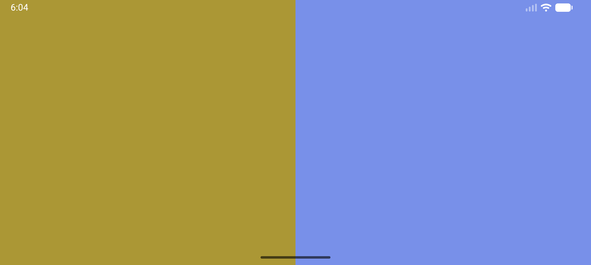

### 3.6. Контрольное задание: Навигационное меню (модуль `MireaProject`)

Для закрепления навыков работы с фрагментами был "с нуля" (из пустого шаблона Activity) собран паттерн Navigation Drawer. Были настроены `DrawerLayout`, `NavigationView` и собственный `Toolbar`. Управление фрагментами делегировано современному архитектурному компоненту — Navigation Component (использование графа навигации `NavGraph` и контейнера `NavHostFragment`). 
Также была реализована сложная верстка фрагмента данных с использованием UI-элементов Material 3 (различные типы `MaterialCardView`).

**Листинг** `build.gradle` (Подключение библиотек):
```gradle
android {
    ...
    buildFeatures {
        viewBinding true
    }
}
dependencies {
    implementation 'androidx.navigation:navigation-fragment:2.7.7'
    implementation 'androidx.navigation:navigation-ui:2.7.7'
    implementation 'com.google.android.material:material:1.11.0'
    ...
}
```

**Листинг** `themes.xml` (Отключение системного Toolbar):
```xml
<resources>
    <style name="Base.Theme.Lesson3" parent="Theme.Material3.DayNight.NoActionBar">
        <!-- Настройки цветов -->
    </style>
</resources>
```

**Листинг** `fragment_data.xml` (Фрагмент с Material CardView):
```xml
<<?xml version="1.0" encoding="utf-8"?>
<androidx.core.widget.NestedScrollView xmlns:android="http://schemas.android.com/apk/res/android"
    xmlns:app="http://schemas.android.com/apk/res-auto"
    xmlns:tools="http://schemas.android.com/tools"
    android:layout_width="match_parent"
    android:layout_height="match_parent"
    android:background="?attr/colorSurface"
    tools:context=".DataFragment">

    <LinearLayout
        android:layout_width="match_parent"
        android:layout_height="wrap_content"
        android:orientation="vertical"
        android:padding="16dp">

        <TextView
            android:layout_width="match_parent"
            android:layout_height="wrap_content"
            android:layout_marginBottom="24dp"
            android:text="Сфера IT и Мобильная Разработка"
            android:textAppearance="?attr/textAppearanceHeadlineMedium"
            android:textColor="?attr/colorPrimary"
            android:textStyle="bold" />

        <com.google.android.material.card.MaterialCardView
            style="@style/Widget.Material3.CardView.Elevated"
            android:layout_width="match_parent"
            android:layout_height="wrap_content"
            android:layout_marginBottom="16dp"
            app:cardCornerRadius="16dp"
            app:cardElevation="4dp">

            <LinearLayout
                android:layout_width="match_parent"
                android:layout_height="wrap_content"
                android:orientation="vertical"
                android:padding="16dp">

                <TextView
                    android:layout_width="wrap_content"
                    android:layout_height="wrap_content"
                    android:layout_marginBottom="8dp"
                    android:text="Общее описание"
                    android:textAppearance="?attr/textAppearanceTitleLarge" />

                <TextView
                    android:layout_width="wrap_content"
                    android:layout_height="wrap_content"
                    android:text="Информационные технологии — стремительно развивающаяся отрасль. Внедрение мобильных решений, нейросетей и машинного обучения трансформирует бизнес, автоматизируя рутину и создавая новые возможности для миллиардов пользователей по всему миру."
                    android:textAppearance="?attr/textAppearanceBodyMedium" />
            </LinearLayout>
        </com.google.android.material.card.MaterialCardView>

        <com.google.android.material.card.MaterialCardView
            style="@style/Widget.Material3.CardView.Filled"
            android:layout_width="match_parent"
            android:layout_height="wrap_content"
            android:layout_marginBottom="16dp"
            app:cardBackgroundColor="?attr/colorSecondaryContainer"
            app:cardCornerRadius="16dp">

            <LinearLayout
                android:layout_width="match_parent"
                android:layout_height="wrap_content"
                android:orientation="vertical"
                android:padding="16dp">

                <TextView
                    android:layout_width="wrap_content"
                    android:layout_height="wrap_content"
                    android:layout_marginBottom="8dp"
                    android:text="Ключевые тренды"
                    android:textAppearance="?attr/textAppearanceTitleMedium"
                    android:textColor="?attr/colorOnSecondaryContainer" />

                <TextView
                    android:layout_width="wrap_content"
                    android:layout_height="wrap_content"
                    android:lineSpacingExtra="6dp"
                    android:text="• Нативная мобильная разработка (Android)\n• Искусственный интеллект (AI/ML)\n• Облачные вычисления (Cloud)\n• Кибербезопасность данных\n• Интернет вещей (IoT)"
                    android:textAppearance="?attr/textAppearanceBodyMedium"
                    android:textColor="?attr/colorOnSecondaryContainer" />
            </LinearLayout>
        </com.google.android.material.card.MaterialCardView>

        <com.google.android.material.card.MaterialCardView
            style="@style/Widget.Material3.CardView.Outlined"
            android:layout_width="match_parent"
            android:layout_height="wrap_content"
            android:layout_marginBottom="32dp"
            app:cardCornerRadius="16dp"
            app:strokeColor="?attr/colorOutline"
            app:strokeWidth="1dp">

            <LinearLayout
                android:layout_width="match_parent"
                android:layout_height="wrap_content"
                android:orientation="vertical"
                android:padding="16dp">

                <TextView
                    android:layout_width="wrap_content"
                    android:layout_height="wrap_content"
                    android:layout_marginBottom="8dp"
                    android:text="Мой интерес"
                    android:textAppearance="?attr/textAppearanceTitleMedium" />

                <TextView
                    android:layout_width="wrap_content"
                    android:layout_height="wrap_content"
                    android:text="Я увлекаюсь разработкой приложений на ОС Android. Изучение Java, использование современных библиотек и архитектурных компонентов (таких как Navigation Component и фрагменты) позволяет мне реализовывать удобные и функциональные интерфейсы."
                    android:textAppearance="?attr/textAppearanceBodyMedium" />
            </LinearLayout>
        </com.google.android.material.card.MaterialCardView>

    </LinearLayout>
</androidx.core.widget.NestedScrollView>
```

**Листинг** `fragment_web_view.xml`:
```xml
<?xml version="1.0" encoding="utf-8"?>
<FrameLayout xmlns:android="http://schemas.android.com/apk/res/android"
    android:layout_width="match_parent" android:layout_height="match_parent">
    <WebView android:id="@+id/webView" android:layout_width="match_parent" android:layout_height="match_parent"/>
</FrameLayout>
```

**Листинг** `WebViewFragment.java`:
```java
package ru.mirea.danilov.mireaproject;

import android.os.Bundle;

import androidx.fragment.app.Fragment;

import android.view.LayoutInflater;
import android.view.View;
import android.view.ViewGroup;

public class WebViewFragment extends Fragment {

    @Override
    public View onCreateView(LayoutInflater inflater, ViewGroup container, Bundle savedInstanceState) {
        View view = inflater.inflate(R.layout.fragment_web_view, container, false);
        android.webkit.WebView webView = view.findViewById(R.id.webView);
        webView.setWebViewClient(new android.webkit.WebViewClient());
        webView.loadUrl("https://www.google.com");
        return view;
    }
}
```

**Листинг** `activity_main_drawer.xml` (Структура бокового меню):
```xml
<?xml version="1.0" encoding="utf-8"?>
<menu xmlns:android="http://schemas.android.com/apk/res/android" xmlns:tools="http://schemas.android.com/tools" tools:showIn="navigation_view">
    <group android:checkableBehavior="single">
        <item android:id="@+id/nav_data" android:title="Отрасль" />
        <item android:id="@+id/nav_webview" android:title="Браузер" />
    </group>
</menu>
```

**Листинг** `mobile_navigation.xml` (Граф навигации):
```xml
<?xml version="1.0" encoding="utf-8"?>
<navigation xmlns:android="http://schemas.android.com/apk/res/android"
    xmlns:app="http://schemas.android.com/apk/res-auto"
    xmlns:tools="http://schemas.android.com/tools"
    android:id="@+id/mobile_navigation"
    app:startDestination="@+id/nav_data">

    <fragment
        android:id="@+id/nav_data"
        android:name="ru.mirea.danilov.mireaproject.DataFragment"
        android:label="Отрасль"
        tools:layout="@layout/fragment_data" />

    <fragment
        android:id="@+id/nav_webview"
        android:name="ru.mirea.danilov.mireaproject.WebViewFragment"
        android:label="Браузер"
        tools:layout="@layout/fragment_web_view" />
</navigation>
```

**Листинг** `activity_main.xml` (Главная разметка с DrawerLayout):
```xml
<?xml version="1.0" encoding="utf-8"?>
<androidx.drawerlayout.widget.DrawerLayout xmlns:android="http://schemas.android.com/apk/res/android"
    xmlns:app="http://schemas.android.com/apk/res-auto"
    xmlns:tools="http://schemas.android.com/tools"
    android:id="@+id/drawer_layout"
    android:layout_width="match_parent"
    android:layout_height="match_parent"
    tools:openDrawer="start">

    <androidx.coordinatorlayout.widget.CoordinatorLayout
        android:layout_width="match_parent"
        android:layout_height="match_parent">

        <com.google.android.material.appbar.AppBarLayout
            android:layout_width="match_parent"
            android:layout_height="wrap_content">
            <androidx.appcompat.widget.Toolbar
                android:id="@+id/toolbar"
                android:layout_width="match_parent"
                android:layout_height="?attr/actionBarSize"
                android:background="?attr/colorPrimary"
                app:titleTextColor="@color/white" />
        </com.google.android.material.appbar.AppBarLayout>

        <androidx.fragment.app.FragmentContainerView
            android:id="@+id/nav_host_fragment_content_main"
            android:name="androidx.navigation.fragment.NavHostFragment"
            android:layout_width="match_parent"
            android:layout_height="match_parent"
            app:defaultNavHost="true"
            app:layout_behavior="@string/appbar_scrolling_view_behavior"
            app:navGraph="@navigation/mobile_navigation" />

    </androidx.coordinatorlayout.widget.CoordinatorLayout>

    <com.google.android.material.navigation.NavigationView
        android:id="@+id/nav_view"
        android:layout_width="wrap_content"
        android:layout_height="match_parent"
        android:layout_gravity="start"
        android:fitsSystemWindows="true"
        app:menu="@menu/activity_main_drawer" />

</androidx.drawerlayout.widget.DrawerLayout>
```

**Листинг** `MainActivity.java` (Связывание логики):
```java
package ru.mirea.danilov.mireaproject;

import android.os.Bundle;
import androidx.appcompat.app.AppCompatActivity;
import androidx.drawerlayout.widget.DrawerLayout;
import androidx.navigation.NavController;
import androidx.navigation.fragment.NavHostFragment;
import androidx.navigation.ui.AppBarConfiguration;
import androidx.navigation.ui.NavigationUI;
import com.google.android.material.navigation.NavigationView;

import ru.mirea.danilov.mireaproject.R;
import ru.mirea.danilov.mireaproject.databinding.ActivityMainBinding;

public class MainActivity extends AppCompatActivity {

    private AppBarConfiguration mAppBarConfiguration;
    private ActivityMainBinding binding;

    @Override
    protected void onCreate(Bundle savedInstanceState) {
        super.onCreate(savedInstanceState);

        binding = ActivityMainBinding.inflate(getLayoutInflater());
        setContentView(binding.getRoot());

        setSupportActionBar(binding.toolbar);

        DrawerLayout drawer = binding.drawerLayout;
        NavigationView navigationView = binding.navView;

        mAppBarConfiguration = new AppBarConfiguration.Builder(
                R.id.nav_data, R.id.nav_webview)
                .setOpenableLayout(drawer)
                .build();

        NavHostFragment navHostFragment = (NavHostFragment) getSupportFragmentManager()
                .findFragmentById(R.id.nav_host_fragment_content_main);
        NavController navController = navHostFragment.getNavController();

        NavigationUI.setupActionBarWithNavController(this, navController, mAppBarConfiguration);
        NavigationUI.setupWithNavController(navigationView, navController);
    }

    @Override
    public boolean onSupportNavigateUp() {
        // ПРАВИЛЬНЫЙ ПОИСК КОНТРОЛЛЕРА ЗДЕСЬ ТАКЖЕ ИЗМЕНЕН
        NavHostFragment navHostFragment = (NavHostFragment) getSupportFragmentManager()
                .findFragmentById(R.id.nav_host_fragment_content_main);
        NavController navController = navHostFragment.getNavController();

        return NavigationUI.navigateUp(navController, mAppBarConfiguration)
                || super.onSupportNavigateUp();
    }
}
```

**Демонстрация работы:**
> *Рисунок 15: Фрагмент DataFragment (отображение карточек Material Design)*
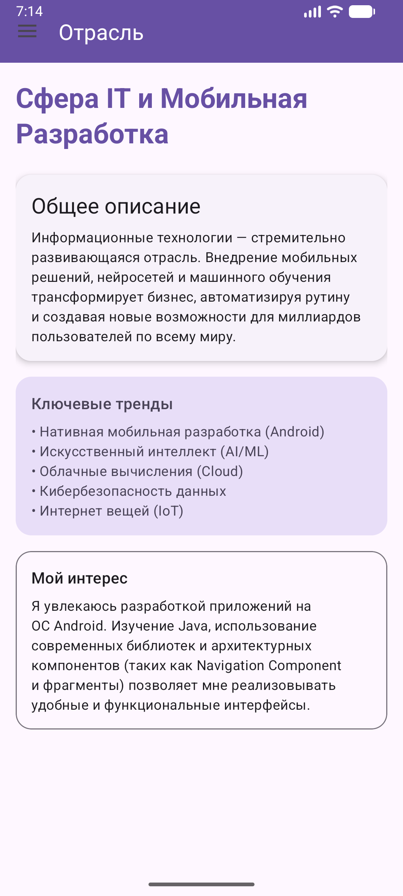
> *Рисунок 16: Открытое боковое меню (Navigation Drawer)*
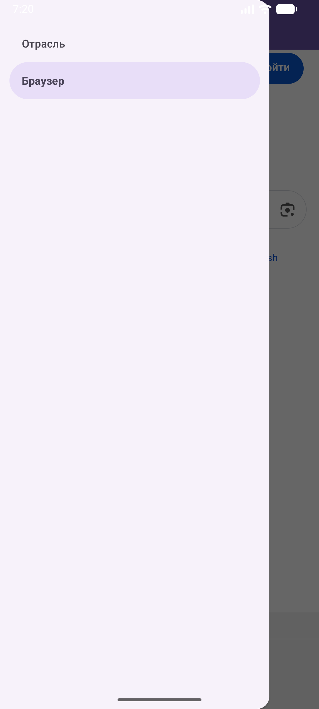
> *Рисунок 17: Фрагмент WebViewFragment (загруженная веб-страница)*
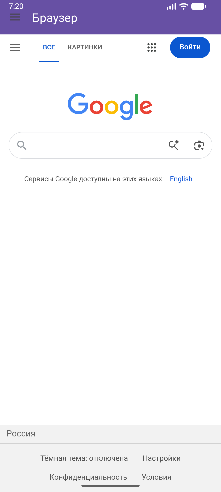

---

## 4. Итоги практической работы

По завершении третьей практической работы были достигнуты следующие результаты:

- Освоена работа с явными и неявными намерениями (Intents). Реализованы механизмы передачи данных, обмена информацией между сторонними приложениями (Sharer) и вызова системных служб ОС Android (звонки, браузер, карты).
- Изучен современный механизм обмена данными между активностями — `Activity Result API`.
- Получены глубокие практические навыки работы с фрагментами: управление их жизненным циклом через `FragmentManager` и поддержка адаптивной верстки под различные ориентации устройства.
- Выполнено усложненное контрольное задание: успешная "ручная" сборка архитектуры Navigation Drawer с применением компонента Navigation (NavGraph, NavHostFragment).
- Закреплены навыки верстки современных UI-интерфейсов с использованием библиотеки Material Components (Material 3). Приложение успешно отлажено и протестировано.