  

# Отчёт по практической работе №5

**Подготовил:**
Студент группы БСБО-09-23
**ФИО:** Данилов Михаил Алексеевич

---

# 1. Цель работы

Целью практической работы является изучение аппаратных возможностей мобильных устройств под управлением операционной системы Android, получение навыков работы с датчиками смартфона, механизмом пользовательских разрешений, системными приложениями камеры и микрофона, а также интеграция аппаратного функционала в комплексное приложение MireaProject.

В ходе выполнения работы были изучены:

- работа с SensorManager и датчиками Android;
- получение данных акселерометра;
- механизм runtime permissions;
- использование системного приложения камеры;
- безопасная передача файлов через FileProvider;
- запись и воспроизведение звука через MediaRecorder и MediaPlayer;
- интеграция аппаратных компонентов в Navigation Drawer приложение.

---

# 2. Структура проекта

Практическая работа состоит из следующих модулей:

1. Lesson5 — отображение списка датчиков устройства.
2. Accelerometer — работа с акселерометром.
3. Camera — использование системной камеры.
4. AudioRecord — работа с микрофоном и диктофоном.
5. MireaProject — контрольное задание с интеграцией аппаратных возможностей.

---

# 3. Выполнение практической работы

---

# 3.1. Получение списка датчиков устройства (модуль Lesson5)

В первом модуле реализовано получение полного списка датчиков мобильного устройства через класс SensorManager. Полученные данные отображаются в компоненте ListView. Для каждого датчика выводится его название и максимальный диапазон значений.

В процессе выполнения задания были изучены:

- работа с SensorManager;
- получение списка сенсоров методом getSensorList();
- отображение коллекции данных через SimpleAdapter.

---

## Листинг activity_main.xml

```javascript
<?xml version="1.0" encoding="utf-8"?>
<androidx.constraintlayout.widget.ConstraintLayout
    xmlns:android="http://schemas.android.com/apk/res/android"
    xmlns:app="http://schemas.android.com/apk/res-auto"
    xmlns:tools="http://schemas.android.com/tools"
    android:layout_width="match_parent"
    android:layout_height="match_parent"
    tools:context=".MainActivity">

    <ListView
        android:id="@+id/listView"
        android:layout_width="0dp"
        android:layout_height="0dp"
        android:layout_margin="8dp"
        app:layout_constraintBottom_toBottomOf="parent"
        app:layout_constraintEnd_toEndOf="parent"
        app:layout_constraintStart_toStartOf="parent"
        app:layout_constraintTop_toTopOf="parent" />

</androidx.constraintlayout.widget.ConstraintLayout>
```

---

## Листинг MainActivity.java

```javascript
package ru.mirea.danilov.lesson5;

import android.content.Context;
import android.hardware.Sensor;
import android.hardware.SensorManager;
import android.os.Bundle;
import android.widget.ListView;
import android.widget.SimpleAdapter;

import androidx.appcompat.app.AppCompatActivity;

import java.util.ArrayList;
import java.util.HashMap;
import java.util.List;

public class MainActivity extends AppCompatActivity {

    private ListView listView;

    @Override
    protected void onCreate(Bundle savedInstanceState) {
        super.onCreate(savedInstanceState);
        setContentView(R.layout.activity_main);

        listView = findViewById(R.id.listView);

        SensorManager sensorManager =
                (SensorManager) getSystemService(Context.SENSOR_SERVICE);

        List<Sensor> sensors = sensorManager.getSensorList(Sensor.TYPE_ALL);

        ArrayList<HashMap<String, Object>> sensorList = new ArrayList<>();

        for (Sensor sensor : sensors) {
            HashMap<String, Object> item = new HashMap<>();
            item.put("Name", sensor.getName());
            item.put("Value", "Макс. диапазон: " + sensor.getMaximumRange());
            sensorList.add(item);
        }

        SimpleAdapter adapter = new SimpleAdapter(
                this,
                sensorList,
                android.R.layout.simple_list_item_2,
                new String[]{"Name", "Value"},
                new int[]{android.R.id.text1, android.R.id.text2}
        );

        listView.setAdapter(adapter);
    }
}
```

---

## Демонстрация работы

> Рисунок 1 – Главный экран приложения со списком датчиков устройства
> 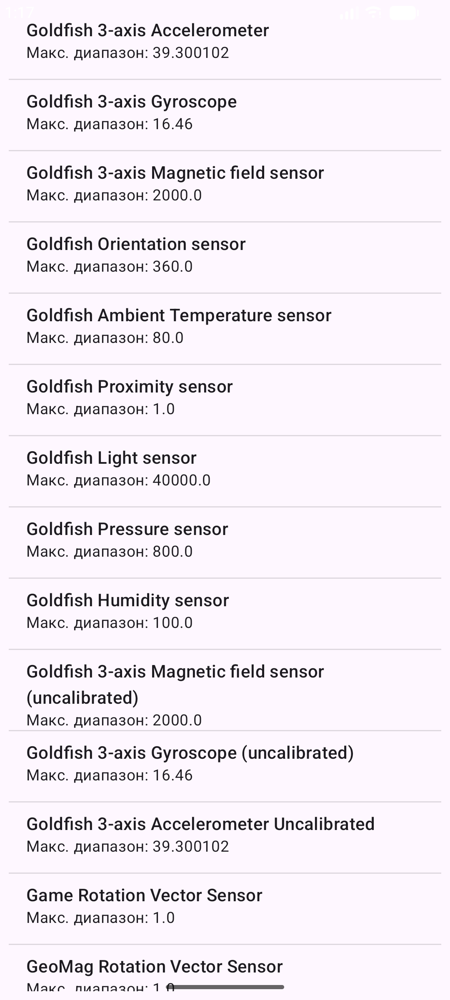

---

# 3.2. Работа с акселерометром (модуль Accelerometer)

Во втором модуле реализовано приложение для получения данных акселерометра в реальном времени. На экране отображаются значения ускорения по трём осям координат:

- X;
- Y;
- Z.

Для обработки событий сенсора был реализован интерфейс SensorEventListener. Регистрация датчика производится в методе onResume(), а отключение — в onPause().

Приложение позволяет отслеживать изменение положения устройства в пространстве при его наклоне и вращении.

---

## Листинг activity_main.xml

```javascript
<?xml version="1.0" encoding="utf-8"?>
<androidx.constraintlayout.widget.ConstraintLayout
    xmlns:android="http://schemas.android.com/apk/res/android"
    xmlns:app="http://schemas.android.com/apk/res-auto"
    xmlns:tools="http://schemas.android.com/tools"
    android:layout_width="match_parent"
    android:layout_height="match_parent"
    tools:context=".MainActivity">

    <TextView
        android:id="@+id/textViewAzimuth"
        android:layout_width="0dp"
        android:layout_height="wrap_content"
        android:layout_margin="16dp"
        android:text="Azimuth:"
        android:textSize="22sp"
        app:layout_constraintBottom_toTopOf="@id/textViewPitch"
        app:layout_constraintEnd_toEndOf="parent"
        app:layout_constraintStart_toStartOf="parent"
        app:layout_constraintTop_toTopOf="parent" />

    <TextView
        android:id="@+id/textViewPitch"
        android:layout_width="0dp"
        android:layout_height="wrap_content"
        android:layout_margin="16dp"
        android:text="Pitch:"
        android:textSize="22sp"
        app:layout_constraintBottom_toTopOf="@id/textViewRoll"
        app:layout_constraintEnd_toEndOf="parent"
        app:layout_constraintStart_toStartOf="parent"
        app:layout_constraintTop_toBottomOf="@id/textViewAzimuth" />

    <TextView
        android:id="@+id/textViewRoll"
        android:layout_width="0dp"
        android:layout_height="wrap_content"
        android:layout_margin="16dp"
        android:text="Roll:"
        android:textSize="22sp"
        app:layout_constraintBottom_toBottomOf="parent"
        app:layout_constraintEnd_toEndOf="parent"
        app:layout_constraintStart_toStartOf="parent"
        app:layout_constraintTop_toBottomOf="@id/textViewPitch" />

</androidx.constraintlayout.widget.ConstraintLayout>
```

---

## Листинг MainActivity.java

```javascript
package ru.mirea.danilov.accelerometer;

import android.content.Context;
import android.hardware.Sensor;
import android.hardware.SensorEvent;
import android.hardware.SensorEventListener;
import android.hardware.SensorManager;
import android.os.Bundle;
import android.widget.TextView;

import androidx.appcompat.app.AppCompatActivity;

public class MainActivity extends AppCompatActivity implements SensorEventListener {

    private TextView azimuthTextView;
    private TextView pitchTextView;
    private TextView rollTextView;

    private SensorManager sensorManager;
    private Sensor accelerometerSensor;

    @Override
    protected void onCreate(Bundle savedInstanceState) {
        super.onCreate(savedInstanceState);
        setContentView(R.layout.activity_main);

        azimuthTextView = findViewById(R.id.textViewAzimuth);
        pitchTextView = findViewById(R.id.textViewPitch);
        rollTextView = findViewById(R.id.textViewRoll);

        sensorManager = (SensorManager) getSystemService(Context.SENSOR_SERVICE);
        accelerometerSensor = sensorManager.getDefaultSensor(Sensor.TYPE_ACCELEROMETER);
    }

    @Override
    protected void onResume() {
        super.onResume();

        if (accelerometerSensor != null) {
            sensorManager.registerListener(
                    this,
                    accelerometerSensor,
                    SensorManager.SENSOR_DELAY_NORMAL
            );
        }
    }

    @Override
    protected void onPause() {
        super.onPause();
        sensorManager.unregisterListener(this);
    }

    @Override
    public void onSensorChanged(SensorEvent event) {
        if (event.sensor.getType() == Sensor.TYPE_ACCELEROMETER) {
            float valueAzimuth = event.values[0];
            float valuePitch = event.values[1];
            float valueRoll = event.values[2];

            azimuthTextView.setText("Azimuth: " + valueAzimuth);
            pitchTextView.setText("Pitch: " + valuePitch);
            rollTextView.setText("Roll: " + valueRoll);
        }
    }

    @Override
    public void onAccuracyChanged(Sensor sensor, int accuracy) {
    }
}
```

---

## Демонстрация работы

> Рисунок 2 – Изменение значений координат при наклоне устройства
> 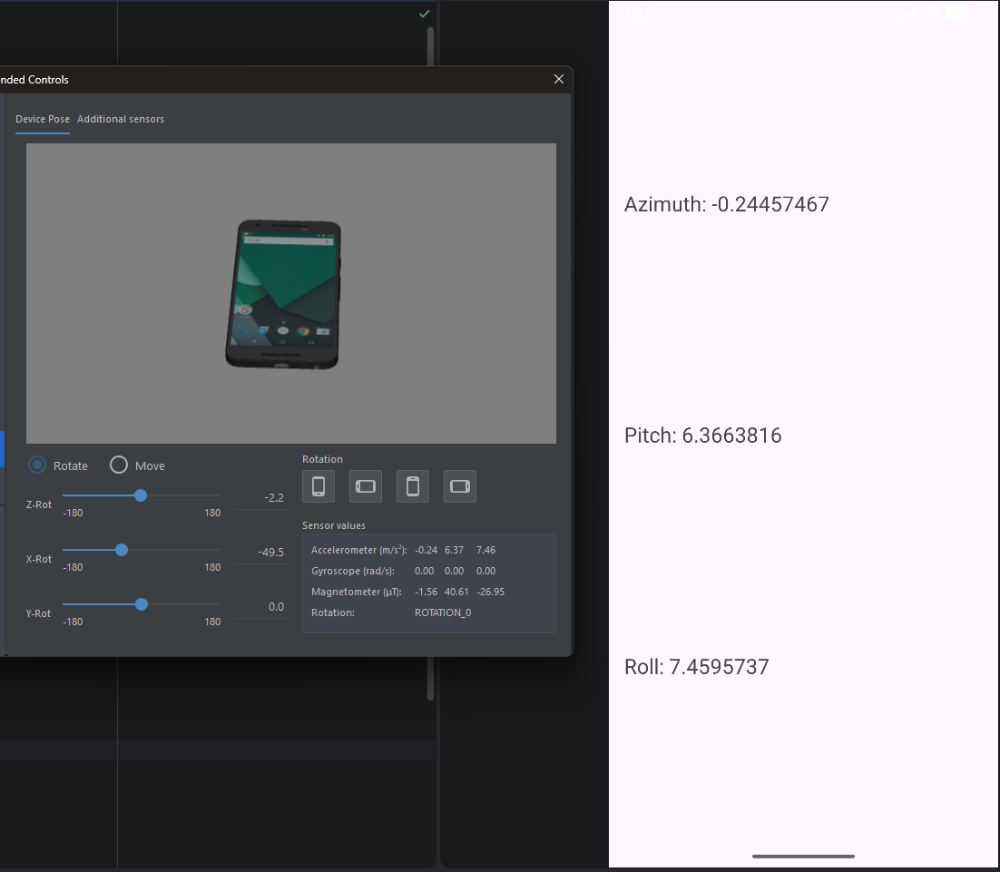

---

# 3.3. Работа с разрешениями Android

В рамках практической работы был изучен механизм runtime permissions, используемый в современных версиях Android.

Для работы камеры и микрофона были реализованы:

- проверка наличия разрешений;
- запрос разрешений у пользователя;
- обработка результата запроса через onRequestPermissionsResult().

Разрешения были добавлены в AndroidManifest.xml.

---

## Листинг AndroidManifest.xml (модуль Camera)

```javascript
<?xml version="1.0" encoding="utf-8"?>
<manifest xmlns:android="http://schemas.android.com/apk/res/android">

    <uses-feature
        android:name="android.hardware.camera"
        android:required="false" />

    <uses-permission android:name="android.permission.CAMERA" />

    <application
        android:allowBackup="true"
        android:theme="@style/Theme.Lesson5"
        android:supportsRtl="true"
        android:label="Camera">

        <provider
            android:name="androidx.core.content.FileProvider"
            android:authorities="${applicationId}.fileprovider"
            android:exported="false"
            android:grantUriPermissions="true">

            <meta-data
                android:name="android.support.FILE_PROVIDER_PATHS"
                android:resource="@xml/paths" />

        </provider>

        <activity
            android:name=".MainActivity"
            android:exported="true">

            <intent-filter>
                <action android:name="android.intent.action.MAIN" />
                <category android:name="android.intent.category.LAUNCHER" />
            </intent-filter>

        </activity>

    </application>

</manifest>
```

---

## Листинг AndroidManifest.xml (модуль AudioRecord)

```javascript
<?xml version="1.0" encoding="utf-8"?>
<manifest xmlns:android="http://schemas.android.com/apk/res/android">

    <uses-permission android:name="android.permission.RECORD_AUDIO" />

    <application
        android:allowBackup="true"
        android:theme="@style/Theme.Lesson5"
        android:supportsRtl="true"
        android:label="AudioRecord">

        <activity
            android:name=".MainActivity"
            android:exported="true">

            <intent-filter>
                <action android:name="android.intent.action.MAIN" />
                <category android:name="android.intent.category.LAUNCHER" />
            </intent-filter>

        </activity>

    </application>

</manifest>
```

---

## Демонстрация работы

> Рисунок 3 – Диалоговое окно запроса разрешения на использование камеры
> 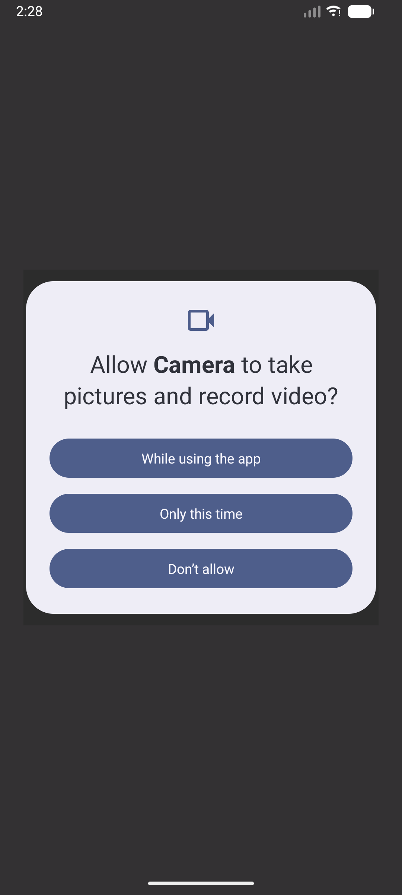

> Рисунок 4 – Диалоговое окно запроса разрешения на использование микрофона
> 

---

# 3.4. Использование системной камеры (модуль Camera)

В модуле Camera реализовано взаимодействие с системным приложением камеры через Intent с действием MediaStore.ACTION_IMAGE_CAPTURE.

Для безопасной передачи изображения был использован FileProvider. После создания фотографии изображение сохраняется во внутреннее хранилище приложения и отображается на экране.

Также была реализована:

- генерация имени файла;
- создание URI через FileProvider;
- обработка результата работы системного приложения камеры.

---

## Листинг paths.xml

```javascript
<?xml version="1.0" encoding="utf-8"?>
<paths>
    <external-files-path
        name="images"
        path="Pictures" />
</paths>
```

---

## Листинг activity_main.xml

```javascript
<?xml version="1.0" encoding="utf-8"?>
<androidx.constraintlayout.widget.ConstraintLayout
    xmlns:android="http://schemas.android.com/apk/res/android"
    xmlns:app="http://schemas.android.com/apk/res-auto"
    xmlns:tools="http://schemas.android.com/tools"
    android:layout_width="match_parent"
    android:layout_height="match_parent"
    tools:context=".MainActivity">

    <ImageView
        android:id="@+id/imageView"
        android:layout_width="0dp"
        android:layout_height="0dp"
        android:layout_margin="24dp"
        android:background="#DDDDDD"
        android:contentDescription="Camera image"
        android:scaleType="centerCrop"
        android:src="@android:drawable/ic_menu_camera"
        app:layout_constraintBottom_toBottomOf="parent"
        app:layout_constraintDimensionRatio="1:1"
        app:layout_constraintEnd_toEndOf="parent"
        app:layout_constraintStart_toStartOf="parent"
        app:layout_constraintTop_toTopOf="parent" />

</androidx.constraintlayout.widget.ConstraintLayout>
```

---

## Листинг MainActivity.java

```javascript
package ru.mirea.danilov.camera;

import android.Manifest;
import android.app.Activity;
import android.content.Intent;
import android.content.pm.PackageManager;
import android.net.Uri;
import android.os.Bundle;
import android.os.Environment;
import android.provider.MediaStore;
import android.view.View;
import android.widget.Toast;

import androidx.activity.result.ActivityResult;
import androidx.activity.result.ActivityResultCallback;
import androidx.activity.result.ActivityResultLauncher;
import androidx.activity.result.contract.ActivityResultContracts;
import androidx.annotation.NonNull;
import androidx.appcompat.app.AppCompatActivity;
import androidx.core.app.ActivityCompat;
import androidx.core.content.ContextCompat;
import androidx.core.content.FileProvider;

import java.io.File;
import java.io.IOException;
import java.text.SimpleDateFormat;
import java.util.Date;
import java.util.Locale;

import ru.mirea.danilov.camera.databinding.ActivityMainBinding;

public class MainActivity extends AppCompatActivity {

    private static final int REQUEST_CODE_PERMISSION = 100;

    private boolean isWork = false;
    private Uri imageUri;
    private ActivityMainBinding binding;
    private ActivityResultLauncher<Intent> cameraActivityResultLauncher;

    @Override
    protected void onCreate(Bundle savedInstanceState) {
        super.onCreate(savedInstanceState);

        binding = ActivityMainBinding.inflate(getLayoutInflater());
        setContentView(binding.getRoot());

        int cameraPermissionStatus = ContextCompat.checkSelfPermission(
                this,
                Manifest.permission.CAMERA
        );

        if (cameraPermissionStatus == PackageManager.PERMISSION_GRANTED) {
            isWork = true;
        } else {
            ActivityCompat.requestPermissions(
                    this,
                    new String[]{Manifest.permission.CAMERA},
                    REQUEST_CODE_PERMISSION
            );
        }

        ActivityResultCallback<ActivityResult> callback = result -> {
            if (result.getResultCode() == Activity.RESULT_OK) {
                binding.imageView.setImageURI(imageUri);
            }
        };

        cameraActivityResultLauncher = registerForActivityResult(
                new ActivityResultContracts.StartActivityForResult(),
                callback
        );

        binding.imageView.setOnClickListener(new View.OnClickListener() {
            @Override
            public void onClick(View view) {
                openCamera();
            }
        });
    }

    private void openCamera() {
        if (!isWork) {
            Toast.makeText(this, "Нет разрешения на использование камеры", Toast.LENGTH_SHORT).show();
            return;
        }

        Intent cameraIntent = new Intent(MediaStore.ACTION_IMAGE_CAPTURE);

        try {
            File photoFile = createImageFile();

            String authorities = getApplicationContext().getPackageName() + ".fileprovider";
            imageUri = FileProvider.getUriForFile(
                    MainActivity.this,
                    authorities,
                    photoFile
            );

            cameraIntent.putExtra(MediaStore.EXTRA_OUTPUT, imageUri);
            cameraActivityResultLauncher.launch(cameraIntent);

        } catch (IOException e) {
            e.printStackTrace();
            Toast.makeText(this, "Ошибка создания файла", Toast.LENGTH_SHORT).show();
        }
    }

    private File createImageFile() throws IOException {
        String timeStamp = new SimpleDateFormat(
                "yyyyMMdd_HHmmss",
                Locale.ENGLISH
        ).format(new Date());

        String imageFileName = "IMAGE_" + timeStamp + "_";

        File storageDirectory = getExternalFilesDir(Environment.DIRECTORY_PICTURES);

        return File.createTempFile(
                imageFileName,
                ".jpg",
                storageDirectory
        );
    }

    @Override
    public void onRequestPermissionsResult(
            int requestCode,
            @NonNull String[] permissions,
            @NonNull int[] grantResults
    ) {
        super.onRequestPermissionsResult(requestCode, permissions, grantResults);

        if (requestCode == REQUEST_CODE_PERMISSION) {
            isWork = grantResults.length > 0
                    && grantResults[0] == PackageManager.PERMISSION_GRANTED;
        }
    }
}
```

---

## Демонстрация работы

> Рисунок 5 – Главный экран модуля Camera
> 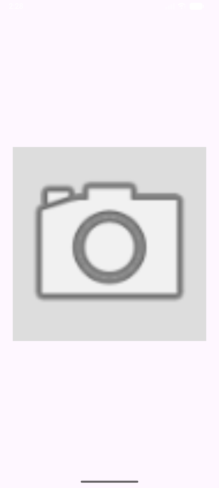

> Рисунок 6 – Запуск системного приложения камеры
> 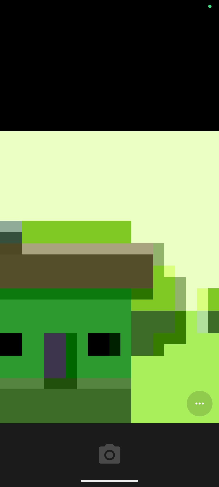

> Рисунок 7 – Сохранённая фотография, отображённая в ImageView
> 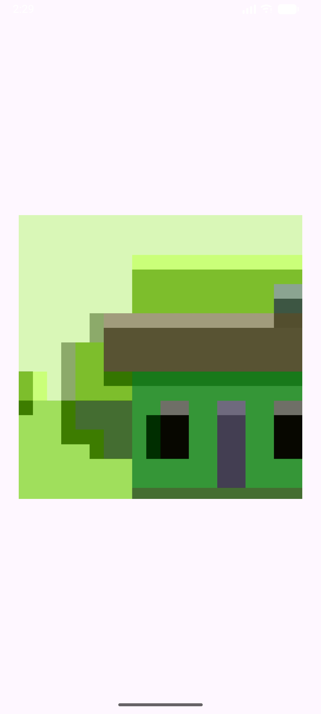

---

# 3.5. Работа с микрофоном и диктофоном (модуль AudioRecord)

В модуле AudioRecord реализован диктофон с возможностью:

- записи аудио;
- сохранения аудиофайла;
- воспроизведения записи.

Для записи использовался MediaRecorder, а для воспроизведения — MediaPlayer.

Во время записи блокируется кнопка воспроизведения, а во время воспроизведения — кнопка записи, что предотвращает конфликт состояний.

Также были изучены:

- форматы записи аудио;
- кодеки;
- управление состояниями MediaRecorder.

---

## Листинг AndroidManifest.xml

```javascript
<?xml version="1.0" encoding="utf-8"?>
<manifest xmlns:android="http://schemas.android.com/apk/res/android">

    <uses-permission android:name="android.permission.RECORD_AUDIO" />

    <application
        android:allowBackup="true"
        android:theme="@style/Theme.Lesson5"
        android:supportsRtl="true"
        android:label="AudioRecord">

        <activity
            android:name=".MainActivity"
            android:exported="true">

            <intent-filter>
                <action android:name="android.intent.action.MAIN" />
                <category android:name="android.intent.category.LAUNCHER" />
            </intent-filter>

        </activity>

    </application>

</manifest>
```

---

## Листинг activity_main.xml

```javascript
<?xml version="1.0" encoding="utf-8"?>
<androidx.constraintlayout.widget.ConstraintLayout
    xmlns:android="http://schemas.android.com/apk/res/android"
    xmlns:app="http://schemas.android.com/apk/res-auto"
    xmlns:tools="http://schemas.android.com/tools"
    android:layout_width="match_parent"
    android:layout_height="match_parent"
    tools:context=".MainActivity">

    <Button
        android:id="@+id/recordButton"
        android:layout_width="0dp"
        android:layout_height="wrap_content"
        android:layout_margin="24dp"
        android:text="Начать запись. №5 в списке, группа БСБО-09-23"
        app:layout_constraintBottom_toTopOf="@id/playButton"
        app:layout_constraintEnd_toEndOf="parent"
        app:layout_constraintStart_toStartOf="parent"
        app:layout_constraintTop_toTopOf="parent" />

    <Button
        android:id="@+id/playButton"
        android:layout_width="0dp"
        android:layout_height="wrap_content"
        android:layout_margin="24dp"
        android:text="Воспроизвести"
        app:layout_constraintBottom_toBottomOf="parent"
        app:layout_constraintEnd_toEndOf="parent"
        app:layout_constraintStart_toStartOf="parent"
        app:layout_constraintTop_toBottomOf="@id/recordButton" />

</androidx.constraintlayout.widget.ConstraintLayout>
```

---

## Листинг MainActivity.java

```javascript
package ru.mirea.danilov.audiorecord;

import android.Manifest;
import android.content.pm.PackageManager;
import android.media.MediaPlayer;
import android.media.MediaRecorder;
import android.os.Bundle;
import android.os.Environment;
import android.util.Log;
import android.widget.Button;

import androidx.annotation.NonNull;
import androidx.appcompat.app.AppCompatActivity;
import androidx.core.app.ActivityCompat;
import androidx.core.content.ContextCompat;

import java.io.File;
import java.io.IOException;

import ru.mirea.danilov.audiorecord.databinding.ActivityMainBinding;

public class MainActivity extends AppCompatActivity {

    private static final int REQUEST_CODE_PERMISSION = 200;
    private final String TAG = MainActivity.class.getSimpleName();

    private ActivityMainBinding binding;

    private boolean isWork = false;
    private String recordFilePath;

    private Button recordButton;
    private Button playButton;

    private MediaRecorder recorder = null;
    private MediaPlayer player = null;

    private boolean isStartRecording = true;
    private boolean isStartPlaying = true;

    @Override
    protected void onCreate(Bundle savedInstanceState) {
        super.onCreate(savedInstanceState);

        binding = ActivityMainBinding.inflate(getLayoutInflater());
        setContentView(binding.getRoot());

        recordButton = binding.recordButton;
        playButton = binding.playButton;

        playButton.setEnabled(false);

        recordFilePath = new File(
                getExternalFilesDir(Environment.DIRECTORY_MUSIC),
                "audiorecordtest.3gp"
        ).getAbsolutePath();

        int audioPermissionStatus = ContextCompat.checkSelfPermission(
                this,
                Manifest.permission.RECORD_AUDIO
        );

        if (audioPermissionStatus == PackageManager.PERMISSION_GRANTED) {
            isWork = true;
        } else {
            ActivityCompat.requestPermissions(
                    this,
                    new String[]{Manifest.permission.RECORD_AUDIO},
                    REQUEST_CODE_PERMISSION
            );
        }

        recordButton.setOnClickListener(view -> {
            if (!isWork) {
                return;
            }

            if (isStartRecording) {
                recordButton.setText("Остановить запись");
                playButton.setEnabled(false);
                startRecording();
            } else {
                recordButton.setText("Начать запись. №5 в списке, группа БСБО-09-23");
                playButton.setEnabled(true);
                stopRecording();
            }

            isStartRecording = !isStartRecording;
        });

        playButton.setOnClickListener(view -> {
            if (isStartPlaying) {
                playButton.setText("Остановить воспроизведение");
                recordButton.setEnabled(false);
                startPlaying();
            } else {
                playButton.setText("Воспроизвести");
                recordButton.setEnabled(true);
                stopPlaying();
            }

            isStartPlaying = !isStartPlaying;
        });
    }

    private void startRecording() {
        recorder = new MediaRecorder();

        recorder.setAudioSource(MediaRecorder.AudioSource.MIC);
        recorder.setOutputFormat(MediaRecorder.OutputFormat.THREE_GPP);
        recorder.setOutputFile(recordFilePath);
        recorder.setAudioEncoder(MediaRecorder.AudioEncoder.AMR_NB);

        try {
            recorder.prepare();
        } catch (IOException e) {
            Log.e(TAG, "prepare() failed");
        }

        recorder.start();
    }

    private void stopRecording() {
        recorder.stop();
        recorder.release();
        recorder = null;
    }

    private void startPlaying() {
        player = new MediaPlayer();

        try {
            player.setDataSource(recordFilePath);
            player.prepare();
            player.start();

            player.setOnCompletionListener(mediaPlayer -> {
                playButton.setText("Воспроизвести");
                recordButton.setEnabled(true);
                isStartPlaying = true;
                stopPlaying();
            });

        } catch (IOException e) {
            Log.e(TAG, "prepare() failed");
        }
    }

    private void stopPlaying() {
        if (player != null) {
            player.release();
            player = null;
        }
    }

    @Override
    public void onRequestPermissionsResult(
            int requestCode,
            @NonNull String[] permissions,
            @NonNull int[] grantResults
    ) {
        super.onRequestPermissionsResult(requestCode, permissions, grantResults);

        if (requestCode == REQUEST_CODE_PERMISSION) {
            isWork = grantResults.length > 0
                    && grantResults[0] == PackageManager.PERMISSION_GRANTED;
        }

        if (!isWork) {
            finish();
        }
    }

    @Override
    protected void onStop() {
        super.onStop();

        if (recorder != null) {
            recorder.release();
            recorder = null;
        }

        if (player != null) {
            player.release();
            player = null;
        }
    }
}
```

---

## Демонстрация работы

> Рисунок 8 – Главный экран диктофона
> 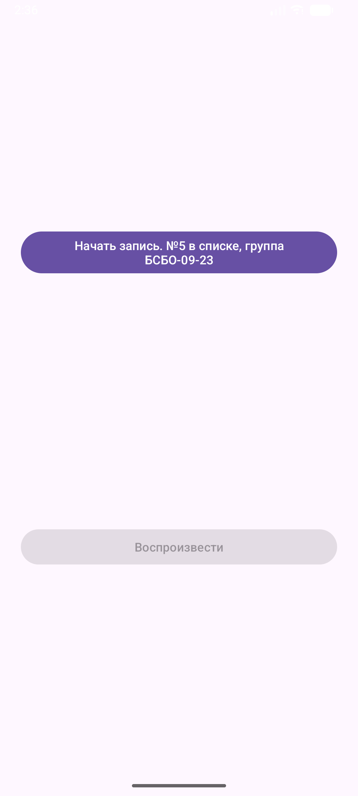

> Рисунок 9 – Процесс записи голосового сообщения
> 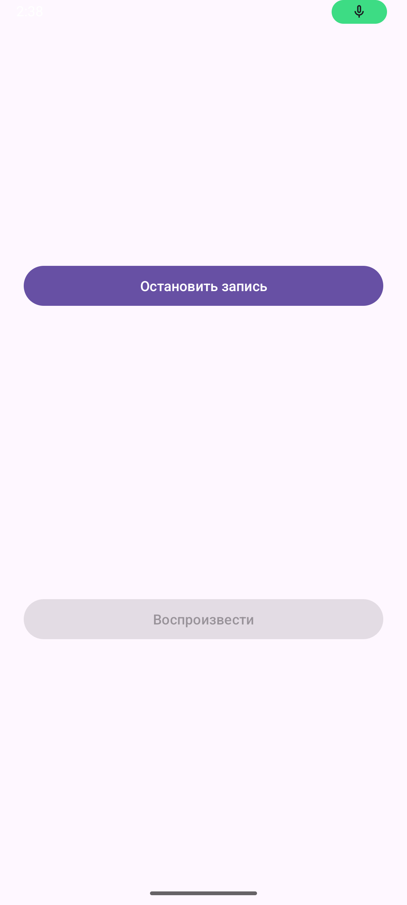

> Рисунок 10 – Воспроизведение записанного аудио
> 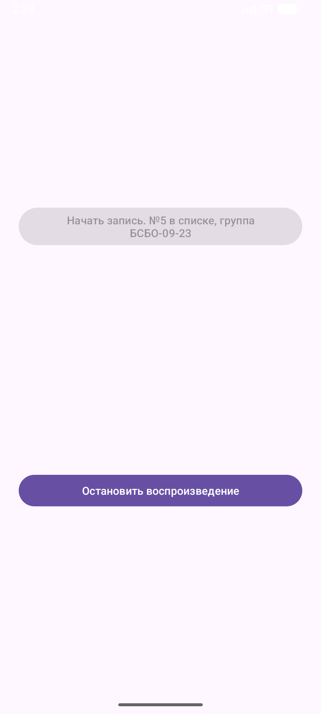

---

# 4. Контрольное задание — интеграция аппаратных возможностей в MireaProject

В контрольном задании аппаратный функционал был интегрирован в комплексное приложение MireaProject с использованием Navigation Drawer и Navigation Component.

Были реализованы три новых экрана:

1. Экран работы с датчиком освещенности.
2. Экран фото-заметок с использованием камеры.
3. Экран голосовых заметок с использованием микрофона.

---

# 4.1. Экран датчика освещенности

На экране реализовано получение данных с датчика освещенности TYPE_LIGHT.

В зависимости от уровня освещения приложение выводит рекомендации:

- недостаточное освещение;
- нормальные условия;
- слишком яркое освещение.

---

## Листинг fragment_hardware.xml

```javascript
<?xml version="1.0" encoding="utf-8"?>
<ScrollView xmlns:android="http://schemas.android.com/apk/res/android"
    android:layout_width="match_parent"
    android:layout_height="match_parent">

    <LinearLayout
        android:layout_width="match_parent"
        android:layout_height="wrap_content"
        android:orientation="vertical"
        android:padding="24dp">

        <TextView
            android:id="@+id/titleTextView"
            android:layout_width="match_parent"
            android:layout_height="wrap_content"
            android:text="Проверка освещенности рабочего места"
            android:textSize="24sp"
            android:textStyle="bold" />

        <TextView
            android:id="@+id/lightValueTextView"
            android:layout_width="match_parent"
            android:layout_height="wrap_content"
            android:layout_marginTop="24dp"
            android:text="Освещенность: ожидание данных..."
            android:textSize="20sp" />

        <TextView
            android:id="@+id/recommendationTextView"
            android:layout_width="match_parent"
            android:layout_height="wrap_content"
            android:layout_marginTop="24dp"
            android:text="Рекомендация появится после получения данных с датчика."
            android:textSize="18sp" />

    </LinearLayout>

</ScrollView>
```

---

## Листинг HardwareFragment.java

```javascript
package ru.mirea.danilov.mireaproject;

import android.content.Context;
import android.hardware.Sensor;
import android.hardware.SensorEvent;
import android.hardware.SensorEventListener;
import android.hardware.SensorManager;
import android.os.Bundle;
import android.view.LayoutInflater;
import android.view.View;
import android.view.ViewGroup;

import androidx.annotation.NonNull;
import androidx.annotation.Nullable;
import androidx.fragment.app.Fragment;

import ru.mirea.danilov.mireaproject.databinding.FragmentHardwareBinding;

public class HardwareFragment extends Fragment implements SensorEventListener {

    private FragmentHardwareBinding binding;
    private SensorManager sensorManager;
    private Sensor lightSensor;

    @Override
    public View onCreateView(
            @NonNull LayoutInflater inflater,
            ViewGroup container,
            Bundle savedInstanceState
    ) {
        binding = FragmentHardwareBinding.inflate(inflater, container, false);
        return binding.getRoot();
    }

    @Override
    public void onViewCreated(
            @NonNull View view,
            @Nullable Bundle savedInstanceState
    ) {
        super.onViewCreated(view, savedInstanceState);

        sensorManager = (SensorManager) requireActivity()
                .getSystemService(Context.SENSOR_SERVICE);

        lightSensor = sensorManager.getDefaultSensor(Sensor.TYPE_LIGHT);

        if (lightSensor == null) {
            binding.lightValueTextView.setText("Датчик освещенности отсутствует");
            binding.recommendationTextView.setText("На этом устройстве невозможно выполнить проверку освещенности.");
        }
    }

    @Override
    public void onResume() {
        super.onResume();

        if (lightSensor != null) {
            sensorManager.registerListener(
                    this,
                    lightSensor,
                    SensorManager.SENSOR_DELAY_NORMAL
            );
        }
    }

    @Override
    public void onPause() {
        super.onPause();

        if (sensorManager != null) {
            sensorManager.unregisterListener(this);
        }
    }

    @Override
    public void onSensorChanged(SensorEvent event) {
        if (event.sensor.getType() == Sensor.TYPE_LIGHT) {
            float light = event.values[0];

            binding.lightValueTextView.setText("Освещенность: " + light + " лк");

            if (light < 100) {
                binding.recommendationTextView.setText(
                        "Слишком темно. Лучше включить дополнительный источник света."
                );
            } else if (light <= 500) {
                binding.recommendationTextView.setText(
                        "Освещение нормальное. Условия подходят для работы."
                );
            } else {
                binding.recommendationTextView.setText(
                        "Слишком ярко. Лучше уменьшить яркость или отойти от прямого света."
                );
            }
        }
    }

    @Override
    public void onAccuracyChanged(Sensor sensor, int accuracy) {
    }

    @Override
    public void onDestroyView() {
        super.onDestroyView();
        binding = null;
    }
}
```

---

## Демонстрация работы

> Рисунок 11 – Экран проверки освещенности
> 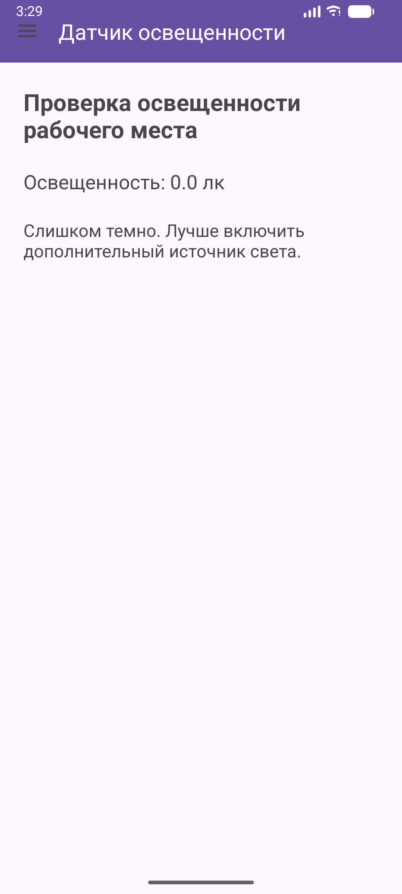

> Рисунок 12 – Изменение рекомендаций при изменении уровня света
> 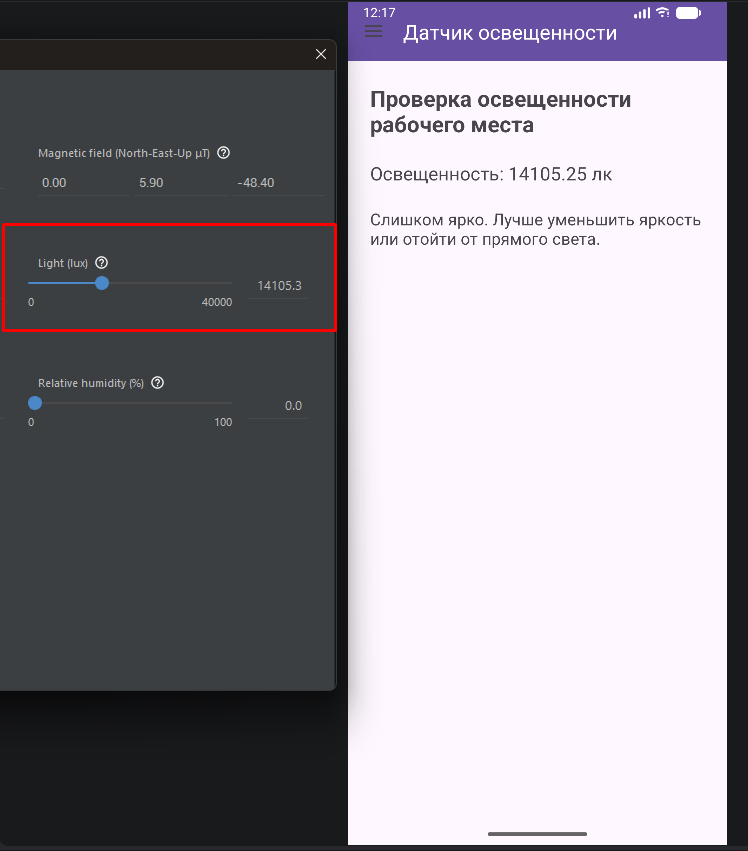

---

# 4.2. Экран фото-заметок

Во втором фрагменте контрольного задания реализована возможность:

- сделать фотографию;
- сохранить изображение;
- прикрепить текстовую заметку к фотографии.

Для реализации использовались:

- Camera Intent;
- FileProvider;
- runtime permissions.

---

## Листинг fragment_camera.xml

```javascript
<?xml version="1.0" encoding="utf-8"?>
<ScrollView xmlns:android="http://schemas.android.com/apk/res/android"
    android:layout_width="match_parent"
    android:layout_height="match_parent">

    <LinearLayout
        android:layout_width="match_parent"
        android:layout_height="wrap_content"
        android:orientation="vertical"
        android:padding="24dp">

        <TextView
            android:layout_width="match_parent"
            android:layout_height="wrap_content"
            android:text="Фото-заметка"
            android:textSize="24sp"
            android:textStyle="bold" />

        <ImageView
            android:id="@+id/photoImageView"
            android:layout_width="match_parent"
            android:layout_height="300dp"
            android:layout_marginTop="24dp"
            android:background="#DDDDDD"
            android:contentDescription="Фото"
            android:scaleType="centerCrop"
            android:src="@android:drawable/ic_menu_camera" />

        <EditText
            android:id="@+id/noteEditText"
            android:layout_width="match_parent"
            android:layout_height="wrap_content"
            android:layout_marginTop="24dp"
            android:hint="Введите текст заметки"
            android:inputType="textMultiLine"
            android:minLines="3" />

        <Button
            android:id="@+id/takePhotoButton"
            android:layout_width="match_parent"
            android:layout_height="wrap_content"
            android:layout_marginTop="24dp"
            android:text="Сделать фото" />

        <TextView
            android:id="@+id/resultTextView"
            android:layout_width="match_parent"
            android:layout_height="wrap_content"
            android:layout_marginTop="24dp"
            android:text="Сделайте фото для заметки."
            android:textSize="16sp" />

    </LinearLayout>

</ScrollView>
```

---

## Листинг CameraFragment.java

```javascript
package ru.mirea.danilov.mireaproject;

import android.Manifest;
import android.app.Activity;
import android.content.Intent;
import android.content.pm.PackageManager;
import android.net.Uri;
import android.os.Bundle;
import android.os.Environment;
import android.provider.MediaStore;
import android.view.LayoutInflater;
import android.view.View;
import android.view.ViewGroup;
import android.widget.Toast;

import androidx.activity.result.ActivityResultLauncher;
import androidx.activity.result.contract.ActivityResultContracts;
import androidx.annotation.NonNull;
import androidx.core.content.ContextCompat;
import androidx.core.content.FileProvider;
import androidx.fragment.app.Fragment;

import java.io.File;
import java.io.IOException;
import java.text.SimpleDateFormat;
import java.util.Date;
import java.util.Locale;

import ru.mirea.danilov.mireaproject.databinding.FragmentCameraBinding;

public class CameraFragment extends Fragment {

    private FragmentCameraBinding binding;
    private Uri imageUri;

    private final ActivityResultLauncher<String> permissionLauncher =
            registerForActivityResult(
                    new ActivityResultContracts.RequestPermission(),
                    isGranted -> {
                        if (isGranted) {
                            openCamera();
                        } else {
                            Toast.makeText(requireContext(), "Разрешение на камеру не получено", Toast.LENGTH_SHORT).show();
                        }
                    }
            );

    private final ActivityResultLauncher<Intent> cameraLauncher =
            registerForActivityResult(
                    new ActivityResultContracts.StartActivityForResult(),
                    result -> {
                        if (result.getResultCode() == Activity.RESULT_OK) {
                            binding.photoImageView.setImageURI(imageUri);

                            String note = binding.noteEditText.getText().toString();

                            if (note.isEmpty()) {
                                binding.resultTextView.setText("Фото добавлено. Текст заметки не заполнен.");
                            } else {
                                binding.resultTextView.setText("Фото добавлено к заметке: " + note);
                            }
                        }
                    }
            );

    @Override
    public View onCreateView(
            @NonNull LayoutInflater inflater,
            ViewGroup container,
            Bundle savedInstanceState
    ) {
        binding = FragmentCameraBinding.inflate(inflater, container, false);
        return binding.getRoot();
    }

    @Override
    public void onViewCreated(
            @NonNull View view,
            Bundle savedInstanceState
    ) {
        super.onViewCreated(view, savedInstanceState);

        binding.takePhotoButton.setOnClickListener(v -> checkCameraPermission());
        binding.photoImageView.setOnClickListener(v -> checkCameraPermission());
    }

    private void checkCameraPermission() {
        if (ContextCompat.checkSelfPermission(
                requireContext(),
                Manifest.permission.CAMERA
        ) == PackageManager.PERMISSION_GRANTED) {
            openCamera();
        } else {
            permissionLauncher.launch(Manifest.permission.CAMERA);
        }
    }

    private void openCamera() {
        Intent cameraIntent = new Intent(MediaStore.ACTION_IMAGE_CAPTURE);

        try {
            File photoFile = createImageFile();

            String authorities = requireContext().getPackageName() + ".fileprovider";

            imageUri = FileProvider.getUriForFile(
                    requireContext(),
                    authorities,
                    photoFile
            );

            cameraIntent.putExtra(MediaStore.EXTRA_OUTPUT, imageUri);
            cameraLauncher.launch(cameraIntent);

        } catch (IOException e) {
            e.printStackTrace();
            Toast.makeText(requireContext(), "Ошибка создания файла", Toast.LENGTH_SHORT).show();
        }
    }

    private File createImageFile() throws IOException {
        String timeStamp = new SimpleDateFormat(
                "yyyyMMdd_HHmmss",
                Locale.ENGLISH
        ).format(new Date());

        String imageFileName = "IMAGE_" + timeStamp + "_";

        File storageDirectory = requireContext()
                .getExternalFilesDir(Environment.DIRECTORY_PICTURES);

        return File.createTempFile(
                imageFileName,
                ".jpg",
                storageDirectory
        );
    }

    @Override
    public void onDestroyView() {
        super.onDestroyView();
        binding = null;
    }
}
```

---

## Демонстрация работы

> Рисунок 13 – Экран создания фото-заметки
> 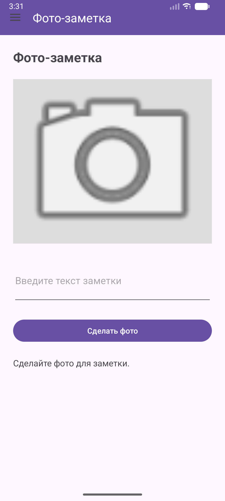

> Рисунок 14 – Выполнение фотографии через системную камеру
> 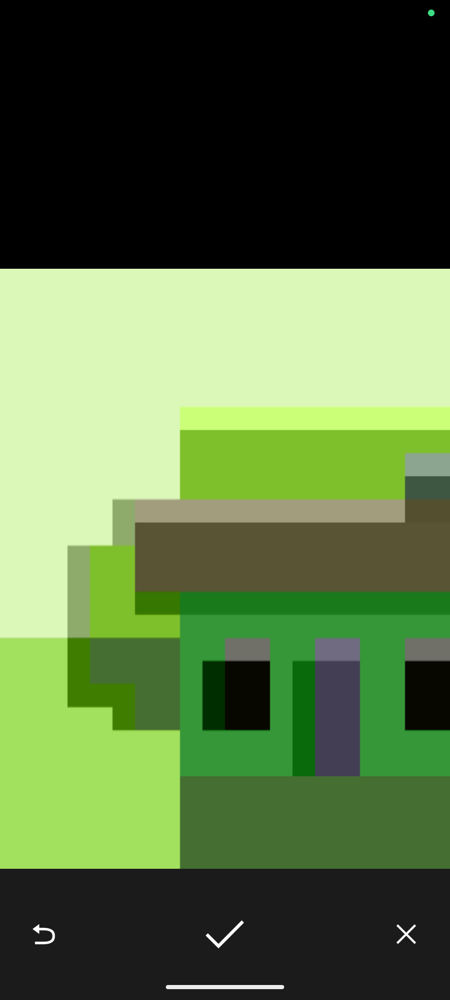

> Рисунок 15 – Готовая фото-заметка
> 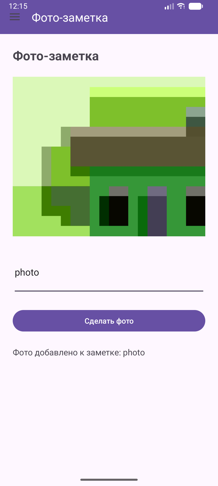

---

# 4.3. Экран голосовых заметок

Третий фрагмент реализует функциональность голосовых заметок.

Пользователь может:

- записать голосовое сообщение;
- воспроизвести его;
- просмотреть статус записи.

Для реализации использовались:

- MediaRecorder;
- MediaPlayer;
- runtime permissions.

---

## Листинг fragment_microphone.xml

```javascript
<?xml version="1.0" encoding="utf-8"?>
<ScrollView xmlns:android="http://schemas.android.com/apk/res/android"
    android:layout_width="match_parent"
    android:layout_height="match_parent">

    <LinearLayout
        android:layout_width="match_parent"
        android:layout_height="wrap_content"
        android:orientation="vertical"
        android:padding="24dp">

        <TextView
            android:layout_width="match_parent"
            android:layout_height="wrap_content"
            android:text="Голосовая заметка"
            android:textSize="24sp"
            android:textStyle="bold" />

        <EditText
            android:id="@+id/titleEditText"
            android:layout_width="match_parent"
            android:layout_height="wrap_content"
            android:layout_marginTop="24dp"
            android:hint="Название голосовой заметки" />

        <Button
            android:id="@+id/recordButton"
            android:layout_width="match_parent"
            android:layout_height="wrap_content"
            android:layout_marginTop="24dp"
            android:text="Начать запись" />

        <Button
            android:id="@+id/playButton"
            android:layout_width="match_parent"
            android:layout_height="wrap_content"
            android:layout_marginTop="16dp"
            android:text="Воспроизвести" />

        <TextView
            android:id="@+id/statusTextView"
            android:layout_width="match_parent"
            android:layout_height="wrap_content"
            android:layout_marginTop="24dp"
            android:text="Запись еще не создана."
            android:textSize="16sp" />

    </LinearLayout>

</ScrollView>
```

---

## Листинг MicrophoneFragment.java

```javascript
package ru.mirea.danilov.mireaproject;

import android.Manifest;
import android.content.pm.PackageManager;
import android.media.MediaPlayer;
import android.media.MediaRecorder;
import android.os.Bundle;
import android.os.Environment;
import android.util.Log;
import android.view.LayoutInflater;
import android.view.View;
import android.view.ViewGroup;
import android.widget.Toast;

import androidx.activity.result.ActivityResultLauncher;
import androidx.activity.result.contract.ActivityResultContracts;
import androidx.annotation.NonNull;
import androidx.core.content.ContextCompat;
import androidx.fragment.app.Fragment;

import java.io.File;
import java.io.IOException;

import ru.mirea.danilov.mireaproject.databinding.FragmentMicrophoneBinding;

public class MicrophoneFragment extends Fragment {

    private final String TAG = MicrophoneFragment.class.getSimpleName();

    private FragmentMicrophoneBinding binding;

    private String recordFilePath;
    private MediaRecorder recorder;
    private MediaPlayer player;

    private boolean isRecording = false;
    private boolean isPlaying = false;
    private boolean hasRecord = false;

    private final ActivityResultLauncher<String> permissionLauncher =
            registerForActivityResult(
                    new ActivityResultContracts.RequestPermission(),
                    isGranted -> {
                        if (isGranted) {
                            startRecording();
                        } else {
                            Toast.makeText(requireContext(), "Разрешение на микрофон не получено", Toast.LENGTH_SHORT).show();
                        }
                    }
            );

    @Override
    public View onCreateView(
            @NonNull LayoutInflater inflater,
            ViewGroup container,
            Bundle savedInstanceState
    ) {
        binding = FragmentMicrophoneBinding.inflate(inflater, container, false);
        return binding.getRoot();
    }

    @Override
    public void onViewCreated(
            @NonNull View view,
            Bundle savedInstanceState
    ) {
        super.onViewCreated(view, savedInstanceState);

        recordFilePath = new File(
                requireContext().getExternalFilesDir(Environment.DIRECTORY_MUSIC),
                "voice_note.3gp"
        ).getAbsolutePath();

        binding.playButton.setEnabled(false);

        binding.recordButton.setOnClickListener(v -> {
            if (isRecording) {
                stopRecording();
            } else {
                checkAudioPermission();
            }
        });

        binding.playButton.setOnClickListener(v -> {
            if (isPlaying) {
                stopPlaying();
            } else {
                startPlaying();
            }
        });
    }

    private void checkAudioPermission() {
        if (ContextCompat.checkSelfPermission(
                requireContext(),
                Manifest.permission.RECORD_AUDIO
        ) == PackageManager.PERMISSION_GRANTED) {
            startRecording();
        } else {
            permissionLauncher.launch(Manifest.permission.RECORD_AUDIO);
        }
    }

    private void startRecording() {
        recorder = new MediaRecorder();

        recorder.setAudioSource(MediaRecorder.AudioSource.MIC);
        recorder.setOutputFormat(MediaRecorder.OutputFormat.THREE_GPP);
        recorder.setOutputFile(recordFilePath);
        recorder.setAudioEncoder(MediaRecorder.AudioEncoder.AMR_NB);

        try {
            recorder.prepare();
            recorder.start();

            isRecording = true;

            binding.recordButton.setText("Остановить запись");
            binding.playButton.setEnabled(false);

            String title = binding.titleEditText.getText().toString();

            if (title.isEmpty()) {
                binding.statusTextView.setText("Идет запись голосовой заметки...");
            } else {
                binding.statusTextView.setText("Идет запись голосовой заметки: " + title);
            }

        } catch (IOException e) {
            Log.e(TAG, "prepare() failed");
            Toast.makeText(requireContext(), "Ошибка записи", Toast.LENGTH_SHORT).show();
        }
    }

    private void stopRecording() {
        if (recorder != null) {
            recorder.stop();
            recorder.release();
            recorder = null;
        }

        isRecording = false;
        hasRecord = true;

        binding.recordButton.setText("Начать запись");
        binding.playButton.setEnabled(true);
        binding.statusTextView.setText("Голосовая заметка сохранена.");
    }

    private void startPlaying() {
        if (!hasRecord) {
            Toast.makeText(requireContext(), "Сначала запишите голосовую заметку", Toast.LENGTH_SHORT).show();
            return;
        }

        player = new MediaPlayer();

        try {
            player.setDataSource(recordFilePath);
            player.prepare();
            player.start();

            isPlaying = true;

            binding.playButton.setText("Остановить воспроизведение");
            binding.recordButton.setEnabled(false);
            binding.statusTextView.setText("Воспроизведение голосовой заметки...");

            player.setOnCompletionListener(mediaPlayer -> stopPlaying());

        } catch (IOException e) {
            Log.e(TAG, "prepare() failed");
            Toast.makeText(requireContext(), "Ошибка воспроизведения", Toast.LENGTH_SHORT).show();
        }
    }

    private void stopPlaying() {
        if (player != null) {
            player.release();
            player = null;
        }

        isPlaying = false;

        binding.playButton.setText("Воспроизвести");
        binding.recordButton.setEnabled(true);
        binding.statusTextView.setText("Воспроизведение остановлено.");
    }

    @Override
    public void onStop() {
        super.onStop();

        if (recorder != null) {
            recorder.release();
            recorder = null;
        }

        if (player != null) {
            player.release();
            player = null;
        }
    }

    @Override
    public void onDestroyView() {
        super.onDestroyView();
        binding = null;
    }
}
```

---

## Демонстрация работы

> Рисунок 16 – Экран голосовых заметок

> Рисунок 17 – Процесс записи голосовой заметки

> Рисунок 18 – Воспроизведение записанного аудио

---

# 4.4. Изменение навигации MireaProject

Для интеграции новых экранов были изменены:

- navigation graph;
- боковое меню Navigation Drawer;
- MainActivity;
- AndroidManifest.xml.

---

## Листинг MainActivity.java

```javascript
package ru.mirea.danilov.mireaproject;

import android.os.Bundle;
import androidx.appcompat.app.AppCompatActivity;
import androidx.drawerlayout.widget.DrawerLayout;
import androidx.navigation.NavController;
import androidx.navigation.fragment.NavHostFragment;
import androidx.navigation.ui.AppBarConfiguration;
import androidx.navigation.ui.NavigationUI;
import com.google.android.material.navigation.NavigationView;

import ru.mirea.danilov.mireaproject.databinding.ActivityMainBinding;

public class MainActivity extends AppCompatActivity {

    private AppBarConfiguration mAppBarConfiguration;
    private ActivityMainBinding binding;

    @Override
    protected void onCreate(Bundle savedInstanceState) {
        super.onCreate(savedInstanceState);

        binding = ActivityMainBinding.inflate(getLayoutInflater());
        setContentView(binding.getRoot());

        setSupportActionBar(binding.toolbar);

        DrawerLayout drawer = binding.drawerLayout;
        NavigationView navigationView = binding.navView;

        mAppBarConfiguration = new AppBarConfiguration.Builder(
                R.id.nav_data,
                R.id.nav_webview,
                R.id.nav_worker,
                R.id.nav_hardware,
                R.id.nav_camera,
                R.id.nav_microphone)
                .setOpenableLayout(drawer)
                .build();

        NavHostFragment navHostFragment = (NavHostFragment) getSupportFragmentManager()
                .findFragmentById(R.id.nav_host_fragment_content_main);
        NavController navController = navHostFragment.getNavController();

        NavigationUI.setupActionBarWithNavController(this, navController, mAppBarConfiguration);
        NavigationUI.setupWithNavController(navigationView, navController);
    }

    @Override
    public boolean onSupportNavigateUp() {
        NavHostFragment navHostFragment = (NavHostFragment) getSupportFragmentManager()
                .findFragmentById(R.id.nav_host_fragment_content_main);
        NavController navController = navHostFragment.getNavController();

        return NavigationUI.navigateUp(navController, mAppBarConfiguration)
                || super.onSupportNavigateUp();
    }
}
```

---

## Листинг activity_main.xml

```javascript
<?xml version="1.0" encoding="utf-8"?>
<androidx.drawerlayout.widget.DrawerLayout xmlns:android="http://schemas.android.com/apk/res/android"
    xmlns:app="http://schemas.android.com/apk/res-auto"
    xmlns:tools="http://schemas.android.com/tools"
    android:id="@+id/drawer_layout"
    android:layout_width="match_parent"
    android:layout_height="match_parent"
    tools:openDrawer="start">

    <androidx.coordinatorlayout.widget.CoordinatorLayout
        android:layout_width="match_parent"
        android:layout_height="match_parent">

        <com.google.android.material.appbar.AppBarLayout
            android:layout_width="match_parent"
            android:layout_height="wrap_content">
            <androidx.appcompat.widget.Toolbar
                android:id="@+id/toolbar"
                android:layout_width="match_parent"
                android:layout_height="?attr/actionBarSize"
                android:background="?attr/colorPrimary"
                app:titleTextColor="@color/white" />
        </com.google.android.material.appbar.AppBarLayout>

        <androidx.fragment.app.FragmentContainerView
            android:id="@+id/nav_host_fragment_content_main"
            android:name="androidx.navigation.fragment.NavHostFragment"
            android:layout_width="match_parent"
            android:layout_height="match_parent"
            app:defaultNavHost="true"
            app:layout_behavior="@string/appbar_scrolling_view_behavior"
            app:navGraph="@navigation/mobile_navigation" />

    </androidx.coordinatorlayout.widget.CoordinatorLayout>

    <!-- Боковое меню -->
    <com.google.android.material.navigation.NavigationView
        android:id="@+id/nav_view"
        android:layout_width="wrap_content"
        android:layout_height="match_parent"
        android:layout_gravity="start"
        android:fitsSystemWindows="true"
        app:menu="@menu/activity_main_drawer" />

</androidx.drawerlayout.widget.DrawerLayout>
```

---

## Листинг mobile_navigation.xml

```javascript
<?xml version="1.0" encoding="utf-8"?>
<navigation xmlns:android="http://schemas.android.com/apk/res/android"
    xmlns:app="http://schemas.android.com/apk/res-auto"
    xmlns:tools="http://schemas.android.com/tools"
    android:id="@+id/mobile_navigation"
    app:startDestination="@+id/nav_data">

    <fragment
        android:id="@+id/nav_data"
        android:name="ru.mirea.danilov.mireaproject.DataFragment"
        android:label="Отрасль"
        tools:layout="@layout/fragment_data" />

    <fragment
        android:id="@+id/nav_webview"
        android:name="ru.mirea.danilov.mireaproject.WebViewFragment"
        android:label="Браузер"
        tools:layout="@layout/fragment_web_view" />

    <fragment
        android:id="@+id/nav_worker"
        android:name="ru.mirea.danilov.mireaproject.WorkerFragment"
        android:label="Фоновая задача"
        tools:layout="@layout/fragment_worker" />

    <fragment
        android:id="@+id/nav_hardware"
        android:name="ru.mirea.danilov.mireaproject.HardwareFragment"
        android:label="Датчик освещенности"
        tools:layout="@layout/fragment_hardware" />

    <fragment
        android:id="@+id/nav_camera"
        android:name="ru.mirea.danilov.mireaproject.CameraFragment"
        android:label="Фото-заметка"
        tools:layout="@layout/fragment_camera" />

    <fragment
        android:id="@+id/nav_microphone"
        android:name="ru.mirea.danilov.mireaproject.MicrophoneFragment"
        android:label="Голосовая заметка"
        tools:layout="@layout/fragment_microphone" />

</navigation>
```

---

## Листинг activity_main_drawer.xml

```javascript
<?xml version="1.0" encoding="utf-8"?>
<menu xmlns:android="http://schemas.android.com/apk/res/android"
    xmlns:tools="http://schemas.android.com/tools"
    tools:showIn="navigation_view">

    <group android:checkableBehavior="single">

        <item
            android:id="@+id/nav_data"
            android:title="Отрасль" />

        <item
            android:id="@+id/nav_webview"
            android:title="Браузер" />

        <item
            android:id="@+id/nav_worker"
            android:title="Фоновая задача (Worker)" />

        <item
            android:id="@+id/nav_hardware"
            android:title="Датчик освещенности" />

        <item
            android:id="@+id/nav_camera"
            android:title="Фото-заметка" />

        <item
            android:id="@+id/nav_microphone"
            android:title="Голосовая заметка" />

    </group>

</menu>
```

---

## Листинг AndroidManifest.xml

```javascript
<?xml version="1.0" encoding="utf-8"?>
<manifest xmlns:android="http://schemas.android.com/apk/res/android"
    xmlns:tools="http://schemas.android.com/tools">
    <uses-permission android:name="android.permission.INTERNET" />
    <uses-permission android:name="android.permission.CAMERA" />
    <uses-permission android:name="android.permission.RECORD_AUDIO" />

    <uses-feature
        android:name="android.hardware.camera"
        android:required="false" />

    <uses-feature
        android:name="android.hardware.microphone"
        android:required="false" />

    <application
        android:allowBackup="true"
        android:dataExtractionRules="@xml/data_extraction_rules"
        android:fullBackupContent="@xml/backup_rules"
        android:icon="@mipmap/ic_launcher"
        android:label="@string/app_name"
        android:roundIcon="@mipmap/ic_launcher_round"
        android:supportsRtl="true"
        android:theme="@style/Theme.MireaProject">

        <provider
            android:name="androidx.core.content.FileProvider"
            android:authorities="${applicationId}.fileprovider"
            android:exported="false"
            android:grantUriPermissions="true">

            <meta-data
                android:name="android.support.FILE_PROVIDER_PATHS"
                android:resource="@xml/paths" />

        </provider>

        <activity
            android:name=".MainActivity"
            android:exported="true">
            <intent-filter>
                <action android:name="android.intent.action.MAIN" />

                <category android:name="android.intent.category.LAUNCHER" />
            </intent-filter>
        </activity>
    </application>

</manifest>
```

---

## Листинг paths.xml

```javascript
<?xml version="1.0" encoding="utf-8"?>
<paths>
    <external-files-path
        name="images"
        path="Pictures" />

    <external-files-path
        name="audio"
        path="Music" />
</paths>
```

---

## Демонстрация работы

> Рисунок 19 – Новые пункты меню в Navigation Drawer
> 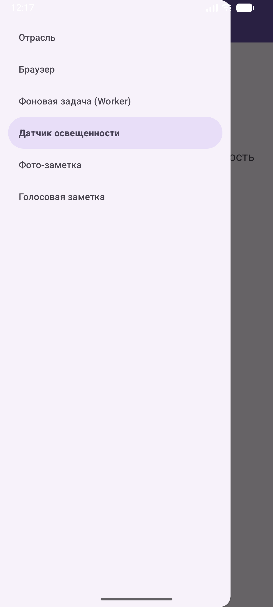

> Рисунок 20 – Экран датчика освещенности в MireaProject
> 

> Рисунок 21 – Экран фото-заметок в MireaProject
> 

> Рисунок 22 – Экран голосовых заметок в MireaProject
> 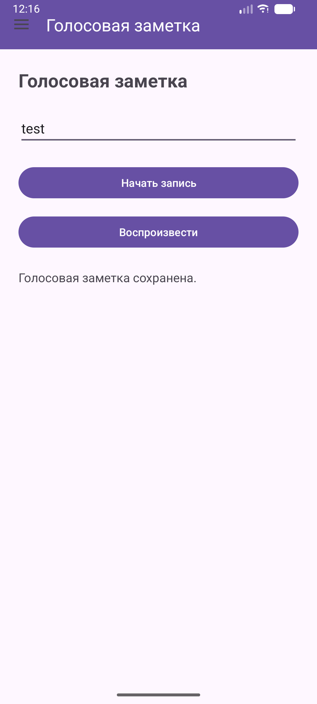

---

# 5. Итоги практической работы

В ходе выполнения практической работы были изучены аппаратные возможности мобильных устройств Android и механизмы взаимодействия приложения с системными компонентами устройства.

В процессе выполнения работы были получены практические навыки:

- работы с датчиками Android;
- обработки данных акселерометра и датчика освещенности;
- использования runtime permissions;
- интеграции системной камеры;
- безопасного обмена файлами через FileProvider;
- записи и воспроизведения звука;
- работы с MediaRecorder и MediaPlayer;
- разработки комплексного многомодульного Android-приложения.

Итогом работы стало создание полнофункционального приложения, использующего аппаратные возможности смартфона и интегрированного в структуру MireaProject.

  